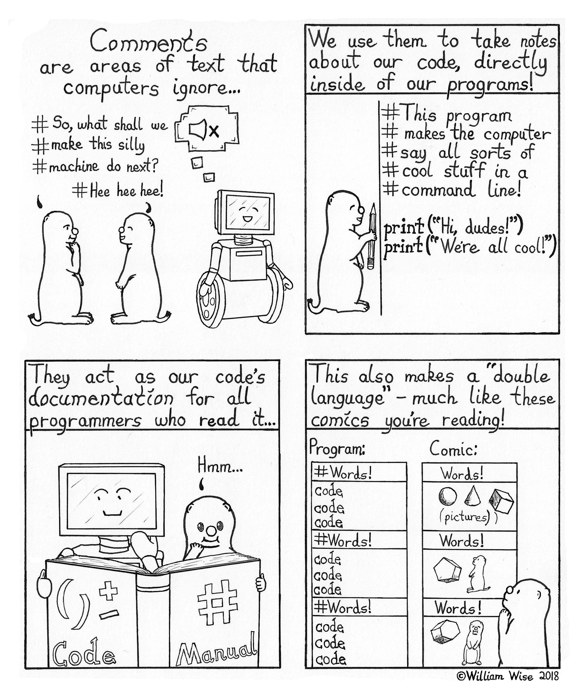

```{r echo=FALSE}
library(tidyverse)
```


# Getting Started in _R_ & RStudio


In this class we will work with and analyze data in _R_. _R_ is a programming language that is widely used for data manipulation, visualization, and analysis. _R_ is an open source program and is free for anyone. Many of the functions and packages (more on this later) we will use within _R_ are written by other _R_ users. While we work with the _R_ program, we will use a different program as the graphical interface. Specifically, we will use the RStudio IDE (integrated development environment) to work in _R_. Both programs are available for free. 

_R_ can be tough to learn initially, especially if you have never programmed before. You will encounter situations where you are completely lost and might have no idea what to do or what the next step should be. It is important not to fall into despair. __This is completely normal!__ Hadley Wickham works for RStudio and is one of the most prolific programmers in R. We will work with many of his packages throughout the course. As Hadley notes, it is completely normal to feel lost when starting to program: 
<center>
{width=10%}
</center>

In addition, it is __important that you ask question when you are stuck.__ We have the discussion forum on Canvas and you should make use of it as much as possible. If you are stuck and don't know where to go next, ask in class or in the discussion forum. __There are no stupid questions! Be the hero who asks the question that everyone is thinking about.__


## Installing _R_ & RStudio

The first step is to correctly install _R_ on your machine. Please go to [https://cloud.r-project.org/](https://cloud.r-project.org/). Then click on the link to download the latest version of _R_ for your specific operating system. Once you have downloaded the program, follow the general instructions to install _R_.

After installing _R_, we need to install the RStudio IDE. You can download the latest version of RStudio [here](https://www.rstudio.com/products/rstudio/download/#download). Once you have downloaded RStudio, follow the instructions and install the program. If you are on Mac, make sure you open RStudio from the Applications folder and delete the file in your "Download" folder. You do not want to open the program from the Downloads folder. 


If you have a lot of trouble installing R and RStudio on your machine, you can also use RStudio inside your web brower in the cloud. You can sign up for a free account here: [https://rstudio.cloud/](https://rstudio.cloud/). Note, however, that the free version of RStudio Cloud limits you to 25 hours of use per month and requires you to be connected to the internet. In general, I would encourage you to install the programs on your machine. 

Once you have installed both programs, open up RStudio. You should see something like this: 
<center>
{width=40%}
</center>

This is the RStudio program. We will work with this program when manipulating, analyzing, or visualizing any data. Start by looking around in RStudio and try to familiarize yourself with the program. 

You can adjust the appearance (for example, font or background color) if you click on RStudio &rarr; Preferences &rarr; Appearance. (On Mac: Tools &rarr; Global Options &rarr; Appearance)

## Getting started with _R_ & RStudio

In the console, you can write code that is immediately executed (or evaluated) by _R_ once you hit enter. For example, set the cursor by clicking to the right of to the little angle bracket >. 


### R as a calculator

Now type `4+4` and hit enter/return. You should see that _R_ evaluates the command and prints the solution. It should look like this:

<center>
{width=40%}
</center>

Just note that in the following text, the output looks slightly different when commands are evaluated:
```{r calculator1}
4+4
```

After _R_ prints the result of the evaluated command, it once again provides the angle bracket, telling us that _R_ is ready to execute the next command. _R_ is a really good calculator, try entering some simple calculations in the console and have _R_ execute them. The following mathematical operators are probably most often used: 

- `+`: addition

- `-`: subtraction

- `/`: division

- `*`: multiplication

- `^`: exponentiation

- `sqrt()`: square root

Now try out some calculations yourself! 
Note that _R_ follows standard order of operations rules, so it can be important to use parentheses.

```{r calculator examples}
7 + 3/5

(7 + 3)/5
```

_R_ also has operators to evaluate logical expressions, meaning _R_ evaluates whether a statement is *true* or *false*: 

- `==`: this operator *evaluates* if the value to its left __is equal to__ the value to its right

- `!=`: this operator *evaluates* if the value to its left __is NOT equal to__ the value to its right

- `<`: smaller than

- `>`: greater than

For example, we can ask _R_ whether three is smaller than five or whether seven is equal to 0: 

```{r calculator examples2}
3 < 5
7 == 0
```

Note that R returns the result in form of logical values, i.e., `TRUE` or `FALSE`.


** Question 1**
Any guess of how we might get R to evaluate whether 6 is greater or equal than 7? 

### More logical operators

We can also connect different logical statements with the logical operators for *and* or *or*: `&`; `|`:

```{r calculator examples3}
3 < 5 & 7 == 0  ## evaluate whether 3 is smaller than 5 AND 7 is equal to zero 

3 < 5 | 7 == 0 ## evaluate whether 3 is smaller than 5 or 7 is equal to zero 
```

** Question 2**
Take 5 minutes to predict and write down what each of the following lines of code will return. Then run them individually: 
```{r practice 2, eval = FALSE}
12/2

32/0

9 == 3*3

3*4 == 12 & 3 > 4

3*4 == 12 | 3 > 4

3*4 != 12 & 3 <= 3

(12 == 3*4 & 3 == 4) | 0 == 0 
```


### Comments & Writing Code in Rscripts

The `#` operator is special in _R_, as it denotes comments. Anything that in a line written behind the `#` is ignored by _R_ and not evaluated. Try writing `# 3 + 4` and hit return. You will see that _R_ does not evaluate the command. The `#` is used to add comments into rcode, we will return to the importance of this later. 

Anything you write in the console is immediately interpreted by _R_ once you hit `Enter`/`Return`. In general, we could enter any command here in the **Console** and have _R_ execute the command. Executing commands directly in the console is bad practice, however. You should avoid doing so as much as possible. When we write and evaluate code directly in the **Console** it is executed at once and then lost.  Similarly, if you point and click to estimate models or created graphs (for example in Stata), it is hard to remember exactly what you have done and not possible for others to reproduce your code. Think of you using a sheet of paper to make a calculation and then immediately discarding the piece of paper. 

Instead of working directly in the Console, we write _Rcode_ in a basic script that we can save (this is equivalent to a do-file, if you have worked with Stata before). Writing code in the script will allow us to save our code and re-execute the commands at any time in the future. Working with scripts also ensures that our work is _reproducible_, i.e., others can go back and check whether our work was correct. This is of great importance, especially when doing scientific research, or for your professor to check your exam :).  

To open a new _rscript_, click on the little white plus in the upper left corner of RStudio and select `R Script`.
<center>
{width=25%} {width=22%}
</center>

Once you have an rscript open, the first step should be to save it somewhere sensible. For example, you might create a folder for this course and save all rscripts for class in that folder. You should pick a name for your rscript that makes sense and reminds you about the contents of the script. For example, you could save this first rscript as `Rcrashcourse.R` or `Rcrashcourse_day1.R`. 

**You should practice writing anything you do in _R_ in a rscript** and execute the code from the script. Start by repeating a few of the simple calculations that you did above. Write each calculation in a separate line: 

```{r calculator script}
4+4

9+2

3/2
```

You might notice that nothing happens when you write code in the rscript and hit enter. To execute the rcode that is in our script, we specifically have to instruct R to evaluate the chunk of code, i.e., send it to the console. There are multiple ways to do so. For example, we can evaluate a single line by having the cursor in the line we want to execute and then hitting `Ctrl + Enter` (Windows) or `Command + Return` (Mac). Alternatively, you can select chunks of code (in a single or over multiple lines) to execute and then hit `Ctrl + Enter` (Windows) or `Command + Return` (Mac). Try selecting some code you wrote and then executing the chunk. 

<center>
{width=35%}
</center>


It is good practice to add plenty of comments to your rscripts. This is done so that others can understand what you are doing (and why). It will also help your future self when you open old code. The comments will help you remember why you wrote certain code and what your reasoning was. Remember, we can include comments using the `#` symbol. Anything in a line behind the `#` symbol will not be executed by _R_. 

```{r comment example}
# this is our first rscript
# in the first line we calculate four plus four
4+4 # comments can also go behind a command we want to execute, anything before # will still be executed
#### we can also use multiple # to mark comments
# or we can have an empty comment line
#
#
# next we calculate nine plus two 
9+2 

# next we want to divide 3 by 2
3/2
```


<center>
{width=35%}
</center>


## R programming language
As with any program, there are different types of variables/data in _R_. The types you will encounter closely follow types of variables you should have encountered in previous methods courses. In our class, we will focus on the following types of data:^[There are other types of data as well, but we won't encounter them much. For example, there is a specific class for *complex* numbers and one for *integers*. We won't make very much use of those types and will ignore them for now.]  
- character 
- double/numeric
- factor
- logical

*Character* data is anything that includes non-numeric characters and is not logical. Characters are known as *strings* in Stata. In _R_, character variables are depicted and entered inside quotation marks. 

```{r character}
"Florian" ## florian is of type character
class("florian")
"Florian is a professor" ## is also one character
"123" ## if you include numbers in quotation marks, R interprets them as characters 
### this would not work, but try it: "1" + "3"R won't perform calculations on character objects
```
*Numeric* data is any variables that are *real* numbers, those are the objects that you can perform mathematical operations on. For our purposes, we will use the terms *numeric* and *double* interchangeably. Even if you enter a "full" number, _R_ will interpret as being numeric type, i.e., `1` is interpreted as `1.0`. 

```{r numeric}
1 ## is numeric
class(1)
1 == 1.000 ### is 1 the same as 1.000
1 + 3 ## if perform calculations on multiple numeric types, the result will also be numeric
```
*Factor* data are categorical variables that can be either numeric or character but distinguish a certain (fixed) number of categories. For example, you could have a variable that distinguishes hair color and can take the following values: "brown", "black", "blond". Factor variables can be unordered (such as hair color) or have an intrinsic order. For example, if you are describing education levels as a categorical variable, we usually have a clear order: "no degree", "high school", "Bachelor", post-graduate degree", etc. _R_ can accomodate both unordered and ordered categorical variables. 

```{r factor}
haircolor <- factor(c("brown", "blond", "black")) ## we are creating a factor variable that can take three values: brown, blond, black

education <- factor(c("no degree", "high school", "Bachelor", "post-graduate degree"), ordered = TRUE) ### education is also a factor variable, but with an intrinsic ordering
education ## as you can see, R denotes the order of the different levels
```
*Logical* variables can take only two values `TRUE` or `FALSE`, which is interpreted by _R_ in binary form as `1` and `0`. The output of logical operations is always of type *logical*. We can use *logical* variables to run conditional operations. 

```{r logical}
1 == 1 ## TRUE

1 < 0 ## FALSE
```
## Objects? What are objects? 

_R_ is an *object oriented programming (OOP)* language, which means that everything in _R_ is organized around **named objects**. These objects can come in different types, such as: 
- functions
- data frames 
- matrices
- vectors
- lists


One important operator in _R_ is the **assignment operator**. With the assignment operator we can assign values/numbers/words to objects that are remembered by _R_. There are actually two assignment operators in _R_: 

1. `<-`

2. `=`

It doesn't really matter which one you use, but you should decide early and use one consistently. In this course, the examples will all use the `<-` assignment operator. You can think of the arrow assigment symbols `<-` as `gets`. 

For example, say we might want _R_ to remember an object that contains my name, so we assign the word 'Florian' to the object called name. Object names have to start with a letter but can include numbers and other symbols. They cannot include empty spaces. It is good practice to only use lowercase letters, numbers, and `_` in your object names.^[See here for a complete style guide for programming in R: [https://style.tidyverse.org/index.html](https://style.tidyverse.org/index.html)] You should always try use reasonable and informative names for your objects, so that you can remember what are the contents of a given object. 
```{r name assignment}
name <- 'Florian' ## object 'name' gets assigned the character vector 'Florian'
```

In this course we will primarily use *function*, *data frames*, and *vectors*. *Functions* usually take one or more inputs (called arguments), perform some operation on the input, and generate an output. For example, the `sqrt()` operator mentioned above is a function that takes one *argument*.
```{r sqrt function}
sqrt(9) ## sqrt() is the function, the input here is 9, the function takes the input and calculates the square root, it then outputs the result
```

*Vectors* are a simple data structure in _R_ that *N* contain elements of one type. A vector is defined by its length, which is the number of elements it contains. Vectors are created by using the function `c()` (combine) and separating the individual elements by commas. It's important to note that all elements of the vector must be of the same type of variable. For example, if you vector includes numeric and character data, R will automatically make all numbers into characters. To create a simple vector of numbers and assign it to the object `number_example` we would write: 
```{r number example}
example_numbers <- c(1, 2, 3, 4, 5) ### object name assignment operator and object contents
```

To print the content (or if too large a preview of the content) of an object, you can just type and execute the object name or use the `print()` function. Of course, the object has to exist, i.e., you may have to have created it first. You can access specific elements in a vector with square brackets `[]` behind the object name  and the specific location number of element.
```{r print example}
example_numbers ## show all elements

print(example_numbers) ## print content of object

example_numbers[1] ## only show the first element
```

*Data frames* are objects that contain multiple (many) observations for multiple variables. You could think of each variable being a vector by itself. Then the variables are bound together into a data frame. Each variable then becomes one column of the data frame. For example, assume we have data on five students. We have recorded their names, height, birth year, and favorite color. 

First, let's create the vectors for each of these variables. It is important, of course, that the data for each person is in the same location in each vector, i.e., if Anna is the first name, we also have to first enter her height and birth year. 

```{r vectors example}
names <- c("Anna", "Otto", "Emmy", "Hanna", "Signe") ## a vector of characters
names

height <- c(1.75, 1.52, 1.89, 1.66, 1.55) ## vector of numeric data, note that R uses . to as the decimal point
height

birth_year <- c(1990, 1986, 1995, 1992, 1991) ## vector of numeric data
birth_year
```

Now we have three different vectors, each including the observations for five students in terms of their names, height, and birth year. We can combine these variables into a data frame using the `data.frame()` function. Note that to combine the different vectors into one data frame, they all have to have the same length (contain the same number of elements).

```{r data frame example}
student_df <- data.frame(names, height, birth_year)
student_df
```

Each of the vectors are now one column in the new data frame, which we called `student_df`. Each row in the data frame corresponds to the data (name, height, birth year) for one person (observation). Note also how you can assign existing objects to new objects. We can again access specific elements of the data frame with the square brackets `[]`. However, since the data frame has two dimensions, we need to specify the location of the element by _row_ and _column_, e.g., `student_df[row, column]`.

```{r access data frame example}
student_df[1,1] ## element in first row, first column

student_df[2,1] ## element in second row, first column

student_df[1,2] ## element in first row, second column

student_df[1, ] ## all elements in first row

student_df[ ,1] ## all elements in first column
```

At least in this course, you will rarely create new data sets. Instead you will work with data sets provided to you or that you have downloaded somewhere, but it is good to first learn the basics. 

The different columns in each data set are the different variables. As you saw above, you can access the specific colums in a data frame by using the square brackets and adding the column number behind a comma: `student_df[ , 1]`.^[Alternatively, you can also use the variable name in quotation marks: `student_df[ , "names"]`.] The best way to access specific variables (columns) in a data frame, however, is by using the variable's name. You can do so with the help of the `$` sign. You first specify the name of the data frame object and then the variable name, separated by the dollar sign `$`: 
```{r access data frame example2}
student_df$names ## access the names variable

student_df$height ## access the heigh variable

student_df$birth_year ## access the birth year variable
```

One of the great things about R is that it is vectorized, this means that operations can be done on the whole vector without going through each element individually. For example, say we want to have the height in cm instead of m, so we need to multiply each of the students' heights by 100. We can just multiply the whole variable by 100 and _R_ automatically does so for each element. 
```{r vectorized}
student_df$height*100 ## multiply each value by 100
```

We can also create a new variable in the data frame. Once again we use the dollar sign `$` with the new variable's name and then assign the values. 
```{r vectorized2}
student_df$height_in_meters <- student_df$height*100 ## multiply each value by 100 and assign to new variable
```


# **Packages**

Packages are the fundamental units of R code. They include reusable R functions, the documentation that describes how to use them, and sample data. 

By default, R installs a set of packages during installation. More packages can be added later, when they are needed for some specific purpose. 

There is an *infinite* amount of packages available that can help you do, literally, anything: from [basic data analysis](https://www.tidyverse.org/), [sending emails](https://github.com/rpremraj/mailR) or [writing blogs](https://rpubs.com/yanalytics/rwordpress) inside R, all the way to packages that have [Flavor Flav yelling “yeaaahhhh, boi!!”](https://github.com/brooke-watson/BRRR) in R as soon as your code successfully completes.

Packages allow you to expand the types of analyses you do be adding other packages. A complete [list of contributed packages](https://cran.r-project.org/web/packages/) is available from CRAN.

### Fortunes

Let's try with one useless, but fun R package, `fortunes`, which... tells fortunes, supplied by various coders over the years.

You *install* a package as follows:

```{r eval=F}
install.packages("[packagename]")
```

For example, we can install this from the R Project repo:

```{r message=F, eval = FALSE}
install.packages("fortunes",repos="https://cloud.r-project.org")
```

After installing, we *load* the package using the `library()` function, as so.

You **always** want to load all the necessary packages at the top of your script.

```{r message=FALSE}
library("fortunes")
```

Now we can use the package functions. `fortunes` has one simple function, `fortune()`, which we can run as so:

```{r message=F}
fortune()
```

### Tidyverse

Now let's try something that you will likely use going forward, the standout "tidyverse" for R.

The *tidyverse* is acollection of R packages designed for data science. All packages share an underlying design philosophy, grammar, and data structures. You can do read data, do data analysis, visualisation and more.

We can install and load the package as follows:

```{r message=F, eval = FALSE}

install.packages("tidyverse",repos="https://cloud.r-project.org")

library(tidyverse)

```

With `tidyverse`, we can do some of the basic things needed, including reading data, wrangling data, and visualising data. We'll get to that below.

------

# **Where to get help and inspiration?**

To be perfectly honest, any data science and programming journey relies *heavily* on help. One of the great things about the R system is that there is a *ton* of help to be found, from internal RStudi resources, to package documentation, online developer communities (like [Stackoverflow](https://stackoverflow.com/)), and much, much more. 

### Online resources

The notes below draw heavily on some these resources, in particular (all freely available online):

- Hadley Wickham's book [R for Data Science](https://r4ds.had.co.nz/index.html).
- Dirk Eddelbuettel's [Data Science Programming Methods lectures](https://stat447.com/).
- Kieran Healy's [Data Visualization: A practical introduction](https://socviz.co/)
- [RStudio Cheatsheets](https://www.rstudio.com/resources/cheatsheets/)

Two bits we'll use below, tidyverse and ggplot2, you can find package details here:
- [tidyverse](https://www.tidyverse.org/)
- [ggplot2](https://ggplot2.tidyverse.org/index.html)

### Help functions in RStudio

You can also find help right here in RStudio.

The `help()` function and `?` help operator in R provide access to the documentation pages for R functions, data sets, and other objects, both for packages in the standard R distribution and for contributed packages. To access documentation for the standard `lm` (linear model) function, for example, enter the command `help(lm)` or `help("lm")`, or `?lm` or `?"lm"` (i.e., the quotes are optional):

```{r}
?lm()
```

### Vignettes

Many packages include *vignettes*, which are discursive documents meant to illustrate and explain facilities in the package. You can discover vignettes by accessing the help page for a package, or via the browseVignettes() function: the command `browseVignettes()` opens a list of vignettes from all of your installed packages in your browser, while `browseVignettes(package=package-name)` (e.g., `browseVignettes(package="survival")`) shows the vignettes, if any, for a particular package. `vignette()` is employed similarly, but displays a list of vignettes in text form.

### R Help on the Internet

There are internet search sites that are specialized for R searches, including [search.r-project.org](https://www.search.r-project.org).

It is also possible to use a general search site like Google, by qualifying the search with “R” or the name of an R package (or both). It can be particularly helpful to paste an error message into a search engine to find out whether others have solved a problem that you encountered.

------

# **Data loading and wrangling**

### Reading data

R can read or write just about anything from text files, just about any existing database backend, specialised files (xls,xlsx, statistics packages), via connections from programs, URLs, and more.

`Tidyverse` has a package called `readr` which is great for importing data into R. 

Most of `readr`’s functions are concerned with turning flat files into data frames:

* read_csv() reads comma delimited files, 
* read_csv2() reads semicolon separated files (common in countries where , is used as the decimal place), 
* read_tsv() reads tab delimited files, and read_delim() reads in files with any delimiter.

These functions all have similar syntax: once you’ve mastered one, you can use the others with ease. For the rest of this chapter we’ll focus on read_csv(). Not only are csv files one of the most common forms of data storage, but once you understand read_csv(), you can easily apply your knowledge to all the other functions in readr.

### read_csv()/read_csv2()

Let's work with the `read_csv` option first: Often you'll be loading in Comma-separated values (.csv) files, basically slimmed-down Excel files.

The first argument to read_csv() is the most important: it’s the path to the file to read.

The `read_csv()` function can read both from online and from an online location - with a URL - or from your local data.

Let's try loading .csv file called heights.csv from an online location, and saving that to an object called `heights`

```{r}

heights <- read_csv("https://raw.githubusercontent.com/phdskat/RCrashcourse2/main/heights.csv")

```

We can do the exact same from your loca data - if you download the `heights.csv` file from the [RCrashcourse2 repository](https://github.com/phdskat/RCrashcourse2).

You then have to put the data somewhere useful for the package to load your data. 

One common thing to do can do is place it right next to your R project files, if you have set up an R project. R's starting point when load files is that they are placed in the R project folder, so that you can easily read it:

```{r}

heights <- read_csv("heights.csv")

```

When you run `read_csv()` it prints out a column specification that gives the name and type of each column.

### Wrangling

Data wrangling is the art of getting your data into R in a useful form for visualisation and modelling. Data wrangling is very important: without it you can’t work with your own data! 

Often you’ll need to create some new variables or summaries, or maybe you just want to rename the variables or reorder the observations in order to make the data a little easier to work with.

Here, we'll go through how to (over)view your data, how to over(view) your data, basic data transformation, and how to do basic exploratory data analysis.

### Viewing your data

Let's start with the `heights` data again. 

The `View()` function in R invokes a spreadsheet-style data viewer on a matrix-like R object. To view all the contents of a defined object, use the `View()` function:

```{r}
#View(heights)
```

### Glance at data

The `head()` function the first or last parts of a vector, matrix, table, data frame or function:

```{r}
head(heights)
```

### The tidyverse pipe!

Pipes are a powerful tool for clearly expressing a sequence of multiple operations. So far, you’ve just been calling functions plainly. Here, it's time to explore the pipe in more detail.

The pipe, `%>%`, comes from the `magrittr` package by Stefan Milton Bache. Packages in the tidyverse load %>% for you automatically, so you don’t usually load magrittr explicitly.

The point of the pipe is to help you write code in a way that is easier to read and understand. To see why the pipe is so useful, we’re going to explore a number of ways of writing the same code. Let's use the code above:

```{r}

# To see the head() or our data, we can either do this, which is the old way of doing things:

head(heights)

# Or we can pass the data object, with the pipe, to the head() function. It's the same outcome. We will use this going forward.

heights %>% head()

```

### Then pull request it into Florian's github

This is trivial when doing single operations, but when you do multiple ones, as we'll see below, it is incredibly useful!

### Filtering

`filter()` allows you to subset observations based on their values. The first argument is the name of the data frame. The second and subsequent arguments are the expressions that filter the data frame. For example, we can select everyone aged exactly 45 in the data:

```{r}

heights %>% filter(age==45)

```

When you run that line of code, the `dplyr` package in tidyverse executes the filtering operation and returns a new data frame. If you want to save the result, you’ll need to use the assignment operator, `<-`:

```{r}

age45 <- heights %>% filter(age == 45)

```

### Arranging

`arrange()` works similarly to `filter()` except that instead of selecting rows, it changes their order. It takes a data frame and a set of column names (or more complicated expressions) to order by. If you provide more than one column name, each additional column will be used to break ties in the values of preceding columns:

```{r}

heights %>% arrange(age)

```

Use `desc()` to re-order by a column in descending order:

```{r}

heights %>% arrange(desc(age))

```

### Select

It’s not uncommon to get datasets with hundreds or even thousands of variables. In this case, the first challenge is often narrowing in on the variables you’re actually interested in. `select()` allows you to rapidly zoom in on a useful subset using operations based on the names of the variables.

```{r}

# Select columns by name

select(heights, sex, age, race)

```

### Add new variables

Besides selecting sets of existing columns, it’s often useful to add new columns that are functions of existing columns. That’s the job of `mutate()`:

```{r}

# we can use the pipe to first add a new column, then arrange by it, so we get a list of the tallest people (in cm)

heights %>% 
  mutate(heightcm = height * 2.54) %>% 
  arrange(-heightcm)

```

### Summarise

The last key verb is `summarise()`. It collapses a data frame to a single row.

The `summarise()` function is most useful when we pair it with `group_by()`. This changes the unit of analysis from the complete dataset to individual groups. Say we want to know the average age of each sex group (males and females)

```{r}


# group this with the pipe

heights %>% 
  group_by(sex) %>% 
  summarise(mean(age))
  

```

There are *many* summary functions available beyond `mean()`:

* Center: mean(), median()
* Spread: sd(), IQR(), mad()
* Range: min(), max(), quantile()
* Position: first(), last(), nth(),
* Count: n(), n_distinct()
* Logical: any(), all()

------

# **Simple regression analysis**

In R, with the `heights` data, we can do a simple linear regression to predict a quantitative outcome y on the basis of one single predictor variable x. 

For instance, we can try to see if the variable `age` is a predictor of `earn`, using the base R `lm()` function (linear model).

The lm command takes the variables in the format:

```{r eval=F}
lm([target variable] ~ [predictor variables], data = [data source])
```

So we do as follows:

```{r}

# create the model

model <- lm(earn ~ age, data = heights)

# see the model

model

```

The output tells us that the predicted earnings for someone aged 0 is just above 19.000, and for every additional 1 year, the average person is expected to earn just about 100 more.

To review the results in more detail, we can use the `summary()` function:

```{r}
summary(model)
```

Here we can see, for instance, the p-values, the R-squared, and so on, which we can use to evaluate the linear model.

------

# **Data visualisation**

>“The simple graph has brought more information to the data analyst’s mind than any other device.”
>— John Tukey

R has several systems for making graphs, but `ggplot2`, which is part of `tidyverse` is one of the most elegant and most versatile. `ggplot2` implements the grammar of graphics, a coherent system for describing and building graphs. With `ggplot2`, you can do more faster by learning one system and applying it in many places.

### First steps

Let’s use our first graph to answer a question: 

Do males people earn more than females? You probably already have an answer, but try to make your answer precise. What does the relationship between sex and earnings look like? 

You can test your answer with the `heights` data frame we have used throughout. A data frame is a rectangular collection of variables (in the columns) and observations (in the rows).

### Creating a ggplot

To plot the sex-earn relationship, run this code to put `sex` on the x-axis and `earn` on the y-axis:

```{r}
ggplot(data = heights) + 
  geom_point(mapping = aes(x = sex, y = earn))
```

The plot shows a strong relationship between sex and earnings. In simple terms, males tend to earn more than women. Does this confirm or refute your hypothesis?

With ggplot2, you begin a plot with the function `ggplot()`. `ggplot()` creates a coordinate system that you can add layers to. The first argument of `ggplot()` is the dataset to use in the graph. So `ggplot(data = heights)` creates an empty graph, but it’s not very interesting so I’m not going to show it here.

You complete your graph by adding one or more layers to `ggplot()`. The function `geom_point()` adds a layer of points to your plot, which creates a scatterplot. ggplot2 comes with many geom functions that each add a different type of layer to a plot. You’ll learn a whole bunch of them throughout this chapter.

Each geom function in ggplot2 takes a `mapping` argument. This defines how variables in your dataset are mapped to visual properties. The `mapping` argument is always paired with `aes()`, and the x and y arguments of aes() specify which variables to map to the x and y axes. ggplot2 looks for the mapped variables in the `data` argument, in this case, `heights`.

### A graphing template

Let’s turn this code into a reusable template for making graphs with ggplot2. To make a graph, replace the bracketed sections in the code below with a dataset, a geom function, or a collection of mappings.

```{r,eval=F}
ggplot(data = <DATA>) + 
  <GEOM_FUNCTION>(mapping = aes(<MAPPINGS>))
```

------

# **Extra stuff (if we have the time):**

### Flows

There are two primary tools of controlling "flows" in R: choices and loops. 

We'll focus on *choices*, in particular "if" and "if/else" statements, which are decision-making devices built into your programming using conditional statements.

You can also use *loops*, like "for" and "while" loops, which allow you to repeatedly run code, typically with changing options.

We'll focus on *choices* here, with `if()` and `ifelse()`.

### if()

The syntax of the if statement is:

```{r,eval=F}
if (test_expression) {
  statement
}
```
If the `test_expression` is `TRUE`, the statement gets executed. But if it’s FALSE, nothing happens.

For example:

```{r}
x <- 5
if(x > 0){
print("Positive number")
}
```

### ifelse()

The syntax of if…else statement is:

```{r eval=F}
if (test_expression) {
  statement1
} else {
  statement2
}
```

For example:

```{r}
x <- -5
if(x > 0){
print("Non-negative number")
} else {
print("Negative number")
}
```


