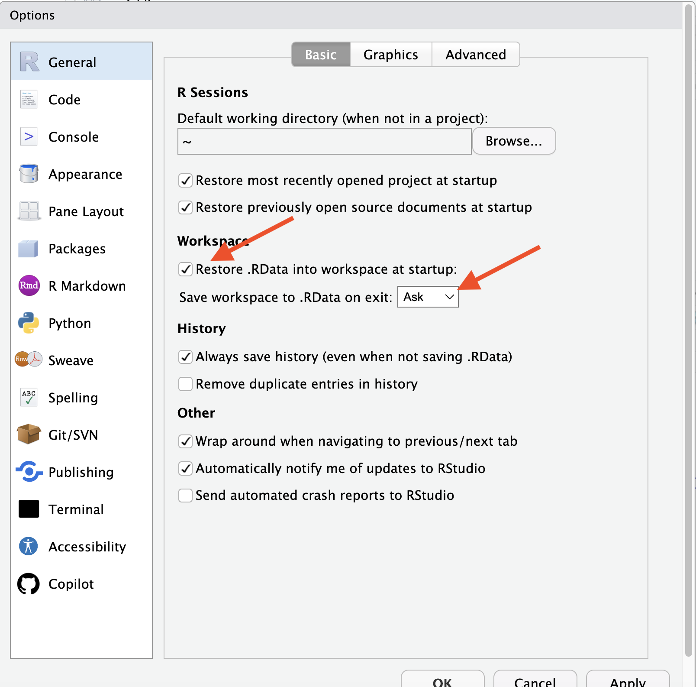
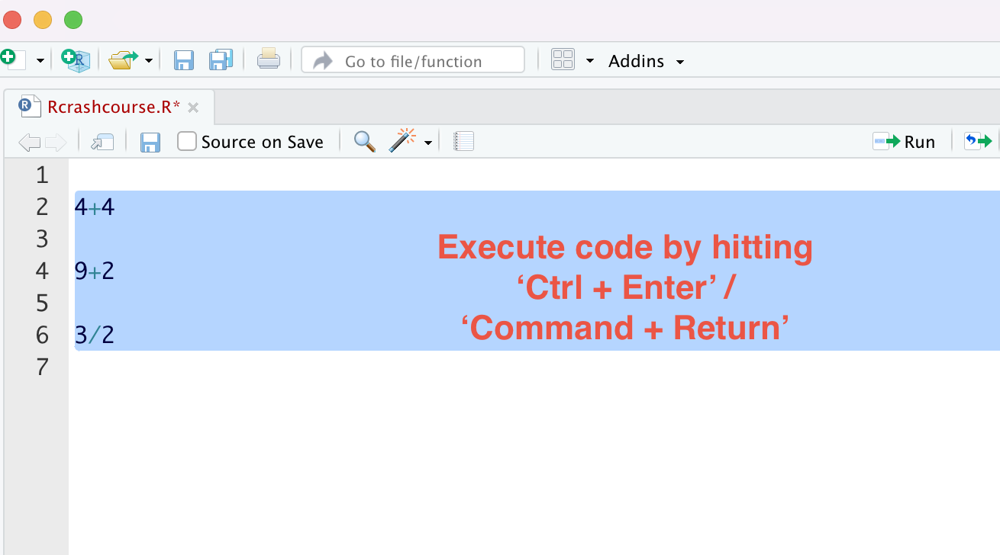
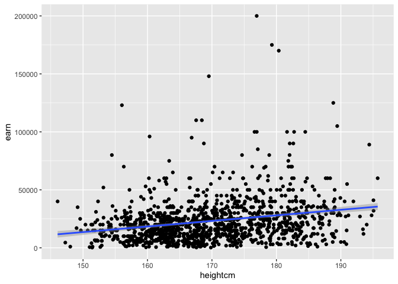

*R* Crash Course CBS
================
Florian M. Hollenbach & Rasmus Corlin Christensen
2024-02-02

# Getting Started in *R* & RStudio

In this class we will work with and analyze data in *R*. *R* is a
programming language that is widely used for data manipulation,
visualization, and analysis. *R* is an open source program and is free
for anyone. Many of the functions and packages (more on this later) we
will use within *R* are written by other *R* users. While we work in the
*R* programming language, we will use a different program as the
graphical interface. Specifically, we will use the RStudio IDE
(integrated development environment) to write and execute code in *R*.
Both programs are available for free. While I recommend that you use
RStudio, you can also run *R* in the terminal, in the cloud, or in other
IDEs.

*R* can be tough to learn initially, especially if you have never
programmed before. You will encounter situations where you are
completely lost and might have no idea what to do or what the next step
should be. It is important not to fall into despair. **This is
completely normal!** Hadley Wickham works for the company behind RStudio
and is one of the most prolific *R* programmers in the world. We will
work with many of his packages throughout the course. As Hadley notes,
it is completely normal to feel lost when starting to program:
<center>

<figure>

<figcaption aria-hidden="true">Hadley Wickham</figcaption>
</figure>

</center>

**So no despair if you feel lost or stuck!** In addition, it is
**important that you ask questions** when you are stuck. We have the
discussion forum on Canvas and you should make use of it as much as
possible. If you are stuck and don’t know where to go next, ask in class
or in the discussion forum. **There are no stupid questions! Be the hero
who asks the question that everyone is thinking about.**

<figure>

<figcaption aria-hidden="true">Alt Text</figcaption>
</figure>

## Installing *R* & RStudio

The first step is to correctly install *R* on your machine. Please go to
<https://cloud.r-project.org/>. Then click on the link to download the
latest version of *R* for your specific operating system. Once you have
downloaded the program, follow the general instructions to install *R*.

After installing *R*, I recommend that you install the RStudio IDE. You
can download the latest version of RStudio
[here](https://posit.co/download/rstudio-desktop/). Once you have
downloaded RStudio, follow the instructions and install the program. If
you are on Mac, make sure you open RStudio from the Applications folder
and delete the file in your “Download” folder. You do not want to open
the program from the Downloads folder.

If you have a lot of trouble installing R and RStudio on your machine,
you can also use RStudio inside your web brower in the cloud. You can
sign up for a free account here: <https://posit.cloud/>. Note, however,
that the free version of RStudio Cloud limits you to 25 hours of use per
month and requires you to be connected to the internet. In general, I
would encourage you to install the programs on your machine.

Once you have installed both programs, open up RStudio. You should see
something like this:
<center>

<figure>

<figcaption aria-hidden="true">RStudio</figcaption>
</figure>

</center>

This is the RStudio IDE. We will work in RStudio to write code to
manipulate, analyze, or visualize data. In contrast to other programs,
such as Excel or Stata, you can’t really *point and click* to analyze
data in R. Instead, we write *code* and then *evaluate* the code.

Start by looking around in RStudio and try to familiarize yourself with
the program.

You can adjust the appearance (for example, font or background color) if
you click on Tools → Global Options → Appearance)

## Getting started with *R* & RStudio

In the console, you can write code that is immediately executed (or
evaluated) by *R* once you hit enter. For example, set the cursor by
clicking to the right of to the little angle bracket \>.

## R as a calculator

Now type `4+4` and hit enter/return. You should see that *R* evaluates
the command and prints the solution. It should look like this:

<center>

<figure>

<figcaption aria-hidden="true">Console</figcaption>
</figure>

</center>

Just note that in the following text, the output looks slightly
different when commands are evaluated:

``` r
4+4
```

    ## [1] 8

After *R* prints the result of the evaluated command, it once again
provides the angle bracket, telling us that *R* is ready to execute the
next command. *R* is a really good calculator, try entering some simple
calculations in the console and have *R* execute them. The following
mathematical operators are probably most often used:

- `+`: addition

- `-`: subtraction

- `/`: division

- `*`: multiplication

- `^`: exponentiation

- `sqrt()`: square root

Now try out some calculations yourself! Note that *R* follows standard
order of operations rules, so it may be important to use parentheses.

``` r
7 + 3/5
```

    ## [1] 7.6

``` r
(7 + 3)/5
```

    ## [1] 2

*R* also has operators to evaluate logical expressions, meaning *R*
evaluates whether a statement is *true* or *false*:

- `==`: this operator *evaluates* if the value to its left **is equal
  to** the value to its right

- `!=`: this operator *evaluates* if the value to its left **is NOT
  equal to** the value to its right

- `<`: smaller than

- `>`: greater than

For example, we can ask *R* whether three is smaller than five or
whether seven is equal to 0:

``` r
3 < 5
```

    ## [1] TRUE

``` r
7 == 0
```

    ## [1] FALSE

Note that R returns the result in form of logical values, i.e., `TRUE`
or `FALSE`.

#### Question 1

Any guess of how we might get R to evaluate whether 6 is greater or
equal than 7?

### More logical operators

We can also connect different logical statements with the logical
operators for *and* or *or*: `&`; `|`:

``` r
3 < 5 & 7 == 0  ## evaluate whether 3 is smaller than 5 AND 7 is equal to zero 
```

    ## [1] FALSE

``` r
3 < 5 | 7 == 0 ## evaluate whether 3 is smaller than 5 or 7 is equal to zero 
```

    ## [1] TRUE

#### Question 2

Take 5 minutes to predict and write down what each of the following
lines of code will return. Then run them individually:

``` r
12/2

32/0

9 == 3*3

3*4 == 12 & 3 > 4

3*4 == 12 | 3 > 4

3*4 != 12 & 3 <= 3

(12 == 3*4 & 3 == 4) | 0 == 0 
```

### RStudio Projects, Workspace, and saving

Before we continue, we should briefly talk about RStudio Projects and
the Workspace.

When you open RStudio, R is running in the background in a new session.
This session is running in the background and you can execute code in
the console. However, once you close RStudio, the session is terminated
and all the code you have written is lost and any data manipulation you
have done is lost. You always want to start with a new session and a
clean workspace when starting RStudio (think of starting on a blank
canvas). To do so, we first want to make sure that the workspace is not
saved when closing RStudio. Open the Settings again: Tools → Global
Options → General. Make sure that the option “Restore .RData into
workspace at startup” is unchecked and that “Save workspace to .RData on
exit” is set to “Never”. See the screenshot below for the initial
setting that needs to be changed.

<center>

<figure>

<figcaption aria-hidden="true">Workspace Seetings</figcaption>
</figure>

</center>

Next we will create a RStudio Project. Projects are a great way to
organize your work and make sure that you can easily reproduce your
work. You can think of a project as a folder that contains all the files
you need for a specific project. You can create a new project by
clicking on File → New Project or on the Project button in the upper
right corner of RStudio. Then select “New Directory” and “New Project”.
You can then name the project and select a location where you want to
save the project. You should make sensible choices for names and
location.

I recommend that you now create a Project for this course and save all
your files for this course in that folder. Within the project folder you
can create additional subfolders, for example for each class or folders
for code and data.

When you open RStudio, it will by default load the last project you
worked on. You can also open a specific project by clicking on File →
Open Project. When a project is open, the working directory (similar to
setting the current directory in Stata – the *cd* command) is
automatically set to the project directory. This means that any files
you want to load or save will be located in the project directory or
*relative to it* (We will get back to this later).

### Comments & Writing Code in Rscripts

The `#` operator is special in *R*, as it denotes comments. Anything
that in a line written behind the `#` is ignored by *R* and not
evaluated. Go to the console and try writing `# 3 + 4`, then hit return.
You will see that *R* does not evaluate the command. The `#` is used to
add comments into rcode, we will return to the importance of this later.

Anything you write in the console is immediately interpreted by *R* once
you hit `Enter`/`Return`. In general, we could enter any command here in
the **Console** and have *R* execute the command. Executing commands
directly in the console is bad practice, however. You should avoid doing
so as much as possible. When we write and evaluate code directly in the
**Console** it is executed at once and then lost. Similarly, if you
point and click to estimate models or created graphs (for example in
Stata), it is hard to remember exactly what you have done and not
possible for others to reproduce your code. Think of you using a sheet
of paper to make a calculation and then immediately discarding the piece
of paper. This is one of the reasons why it is frowned upon to use the
point and click interface in Stata or manipulate data in Excel. Once you
have done something, it is hard to remember exactly what you have done
and it is impossible for others to reproduce your work.

Instead of working directly in the Console, we write *Rcode* in a basic
script that we can save (this is equivalent to a do-file, if you have
worked with Stata before). Writing code in the script will allow us to
save our code and re-execute the commands at any time in the future.
Working with scripts also ensures that our work is *reproducible*, i.e.,
others can go back and check whether our work was correct. This is of
great importance, especially when doing scientific research, or when
your professor wants to check your exam :).

To open a new *rscript*, click on the little white plus in the upper
left corner of RStudio and select `R Script`.
<center>


</center>

Once you have an rscript open, the first step should be to save it
somewhere sensible. For example, if you have created a Project folder
for this course, you might create a subfolder that is called *Code* save
all rscripts for class in that folder (Another option would be to create
a subfolder for each week). You should pick a name for your rscript that
makes sense and reminds you about the contents of the script. For
example, you could save this first rscript as `Rcrashcourse.R` or
`Rcrashcourse_day1.R`.

**You should practice writing anything you do in *R* in a rscript** and
execute the code from the script. Start by repeating a few of the simple
calculations that you did above. Write each calculation in a separate
line:

``` r
4+4
```

    ## [1] 8

``` r
9+2
```

    ## [1] 11

``` r
3/2
```

    ## [1] 1.5

You might notice that nothing happens when you write code in the rscript
and hit enter. To execute the rcode that is in our script, we
specifically have to instruct R to evaluate the chunk of code, i.e.,
send it to the console. There are multiple ways to do so. For example,
we can evaluate a single line by having the cursor in the line we want
to execute and then hitting `Ctrl + Enter` (Windows) or
`Command + Return` (Mac). Alternatively, you can select chunks of code
(in a single or over multiple lines) to execute and then hit
`Ctrl + Enter` (Windows) or `Command + Return` (Mac). Try selecting some
code you wrote and then executing the chunk.

<center>

<figure>

<figcaption aria-hidden="true">Executing code from rscripts</figcaption>
</figure>

</center>

It is good practice to add plenty of comments to your rscripts. This is
done so that others can understand what you are doing (and why). It will
also help your future self when you open old code. The comments will
help you remember why you wrote certain code and what your reasoning
was. Remember, we can include comments using the `#` symbol. Anything in
a line behind the `#` symbol will not be executed by *R*.

``` r
# this is our first rscript
# in the first line we calculate four plus four
4+4 # comments can also go behind a command we want to execute, anything before # will still be executed
```

    ## [1] 8

``` r
#### we can also use multiple # to mark comments
# or we can have an empty comment line
#
#
# next we calculate nine plus two 
9+2 
```

    ## [1] 11

``` r
# next we want to divide 3 by 2
3/2
```

    ## [1] 1.5

<center>

<figure>

<figcaption aria-hidden="true">Practice good commenting (via Prairie
World Comics)</figcaption>
</figure>

</center>

## Types of Variables

As with any program, there are different types of variables/data in *R*.
The types you will encounter closely follow types of variables you
should have encountered in previous methods courses. In our class, we
will focus on the following types of data:[^1]

- character
- double/numeric
- factor
- logical

You can generally ask R to evaluate the type of a value by using the
function `class()` with the relevant value inside the parantheses (We
will cover “functions” in more general terms later).

*Character* data is anything that includes non-numeric characters and is
not logical. Characters are known as *strings* in Stata. In *R*,
character variables are depicted and entered inside quotation marks. You
can not perform mathematical calculations on characters.

``` r
"Florian" ## florian is of type character
```

    ## [1] "Florian"

``` r
class("florian")
```

    ## [1] "character"

``` r
"Florian is a professor" ## is also one character
```

    ## [1] "Florian is a professor"

``` r
"123" ## if you include numbers in quotation marks, R interprets them as characters 
```

    ## [1] "123"

``` r
### this would throw an error, but try it: 
### "1" + "3"   
### R won't perform calculations on character objects
```

*Numeric* data is any variables that are *real* numbers, You can perform
mathematical operations on numeric variables. For our purposes, we will
use the terms *numeric* and *double* interchangeably. Even if you enter
a “full” number (integer), *R* will interpret as being numeric type,
i.e., `1` is interpreted as `1.0` (unless otherwise specificed).

``` r
1 ## is numeric
```

    ## [1] 1

``` r
class(1)
```

    ## [1] "numeric"

``` r
1 == 1.000 ### is 1 the same as 1.000
```

    ## [1] TRUE

``` r
1 + 3 ## if perform calculations on multiple numeric types, the result will also be numeric
```

    ## [1] 4

``` r
1/3
```

    ## [1] 0.3333333

*Factor* data are categorical variables that can be either numeric or
character but distinguish a certain (fixed) number of categories. For
example, you could have a variable that distinguishes hair color and can
take the following values: “brown”, “black”, “blond”. Factor variables
can be unordered (such as hair color) or have an intrinsic order. For
example, if you are describing education levels as a categorical
variable, we usually have a clear order: “no degree”, “high school”,
“Bachelor”, “post-graduate degree”, etc. You might remember ordered
categorical variables as *ordinal* variables. *R* can accommodate both
unordered and ordered categorical variables. We will see how these types
of variables look later on.

*Logical* variables can take only two values `TRUE` or `FALSE`. The
output of logical operations is always of type *logical*. We can use
*logical* variables to run conditional operations.

``` r
1 == 1 ## TRUE
```

    ## [1] TRUE

``` r
1 < 0 ## FALSE
```

    ## [1] FALSE

**Fun fact**: `TRUE` and `FALSE` are represented as by *R* in binary
form as `1` and `0` and can be used in mathematical operations (more on
this later). What do you think would be the result of `(1 == 1)/2` Try
it out.

``` r
1 == 1 ## TRUE
```

    ## [1] TRUE

## Objects? What are objects?

*R* is an *object oriented programming (OOP)* language, which means that
everything in *R* is organized around **named objects**. These objects
can come in different types, such as:

- vectors
- matrices
- data frames
- lists
- functions

We will cover each in turn. If you think of the *R* workspace as a big
cabinet, you can think of objects as little drawers in the cabinet, each
with with some content. These objects are present in the workspace. You
can create new objects, delete objects, and manipulate objects. One of
the many advantages of R over Stata is that you can have multiple
objects in your workspace at the same time. For example, you could have
two different data sets open at the same time or even two different
versions of the same data set.

One important operator in *R* is the **assignment operator**. With the
assignment operator we can assign values/numbers/words to objects that
are remembered by *R*. There are actually two assignment operators in
*R*:

1.  `<-`

2.  `=`

It doesn’t really matter which one you use, but you should decide early
and use one consistently. In this course, the examples will all use the
`<-` assignment operator. You can think of the arrow assignment symbol
`<-` as `gets`.

For example, say we might want to create an object in *R* to save names
in. Let’s create an object that contains my name, so we assign the word
‘Florian’ to the object called name. Object names have to start with a
letter but can include numbers and other symbols. Object names cannot
include empty spaces and are **not** surrounded by quotation marks. It
is good practice to only use lowercase letters, numbers, and `_` in your
object names.[^2] **You should always try use reasonable and informative
names for your objects, so that you can remember what are the contents
of a given object.**

``` r
names <- "Florian" ## object 'name' gets assigned the character vector 'Florian'
```

In this course we will primarily use *function*, *data frames*, and
*vectors*. *Functions* usually take one or more inputs (called
arguments), perform some operation on the input, and generate an output.
For example, the `sqrt()` operator mentioned above is a function that
takes one *argument*. If a function takes multiple arguments, they are
usually separated by a comma, e.g., `plot(x, y)`. We will use a lot of
different functions, some of which will use one, some will use many
arguments.

``` r
sqrt(9) ## sqrt() is the function, the input here is 9, the function takes the input and calculates the square root, it then outputs the result
```

    ## [1] 3

*Vectors* are a simple data structure in *R* that contain *N* elements
of one type. A vector is defined by its length, which is the number of
elements it contains. Vectors are created by using the function `c()`
(combine/concatenate) and separating the individual elements by commas.
It’s important to note that all elements of the vector must be of the
same type of variable. For example, if you vector includes numeric and
character data, R will automatically make all numbers into characters.
To create a simple vector of numbers and assign it to the object
`number_example` we would write:

``` r
number_example <- c(1, 2, 3, 4, 5) ### object name assignment operator and object contents
```

To print the content (or if too large a preview of the content) of an
object, you can just type and execute the object name or use the
`print()` function. Of course, the object has to exist, i.e., you have
to have created it first. You can’t take a drawer out of the cabinet, if
the drawer does not exist. You can access specific elements in a vector
with square brackets `[]` behind the object name and the specific
location number of element. Note that R starts counting at 1 (other
programming languages start at 0, e.g., Python or C++).

``` r
number_example ## show all elements
```

    ## [1] 1 2 3 4 5

``` r
print(number_example) ## print content of object
```

    ## [1] 1 2 3 4 5

``` r
number_example[1] ## only the first element
```

    ## [1] 1

Let’s return to our factor variable type. Here we have two types of
factor variables, first unordered and then ordered. We assign those
variables to a new object called `haircolor` and `education`.

``` r
haircolor <- factor(c("brown", "blond", "black")) ## we are creating a factor variable that can take three values: brown, blond, black

education <- factor(c("no degree", "high school", "Bachelor", "post-graduate degree"), ordered = TRUE) ### education is also a factor variable, but with an intrinsic ordering
education ## as you can see, R denotes the order of the different levels
```

    ## [1] no degree            high school          Bachelor            
    ## [4] post-graduate degree
    ## Levels: Bachelor < high school < no degree < post-graduate degree

*Data frames* are objects that contain multiple (many) observations for
multiple variables. You could think of each variable being a vector by
itself. Then the variables are bound together into a data frame. Each
variable then becomes one column of the data frame. For example, assume
we have data on five students. We have recorded their names, height,
birth year, and favorite color.

First, let’s create the vectors for each of these variables. It is
important, of course, that the data for each person is in the same
location in each vector, i.e., if Anna is the first name, we also have
to first enter her height and birth year.

``` r
names <- c("Anna", "Otto", "Emmy", "Hanna", "Signe") ## a vector of characters, student names
names
```

    ## [1] "Anna"  "Otto"  "Emmy"  "Hanna" "Signe"

``` r
height <- c(1.75, 1.52, 1.89, 1.66, 1.55) ## vector of numeric data, note that R uses . to as the decimal point
height
```

    ## [1] 1.75 1.52 1.89 1.66 1.55

``` r
birth_year <- c(1990, 1986, 1995, 1992, 1991) ## vector of numeric data
birth_year
```

    ## [1] 1990 1986 1995 1992 1991

#### Question 3

Think of an example that you might collect data for. Create three
vectors, each with five hypothetical values for each variable. Make sure
to use *good* names for each vector.

### Combining into data frames

Now we have three different vectors, each including the observations for
five students: their names, height, and birth year. We can combine these
variables into a data frame using the `data.frame()` function. Note that
to combine the different vectors into one data frame, they all have to
have the same length (contain the same number of elements).

``` r
student_df <- data.frame(names, height, birth_year)
student_df
```

    ##   names height birth_year
    ## 1  Anna   1.75       1990
    ## 2  Otto   1.52       1986
    ## 3  Emmy   1.89       1995
    ## 4 Hanna   1.66       1992
    ## 5 Signe   1.55       1991

Each of the vectors are now one column in the new data frame, a new
object which we called `student_df`. Each row in the data frame
corresponds to the data (name, height, birth year) for one person
(observation). Note also how you can assign existing objects to new
objects. We can again access specific elements of the data frame with
the square brackets `[]`. However, since the data frame has two
dimensions, we need to specify the location of the element by *row* and
*column*, e.g., `student_df[row, column]`.

``` r
student_df[1,1] ## element in first row, first column
```

    ## [1] "Anna"

``` r
student_df[2,1] ## element in second row, first column
```

    ## [1] "Otto"

``` r
student_df[1,2] ## element in first row, second column
```

    ## [1] 1.75

``` r
student_df[1, ] ## all elements in first row
```

    ##   names height birth_year
    ## 1  Anna   1.75       1990

``` r
student_df[ ,1] ## all elements in first column
```

    ## [1] "Anna"  "Otto"  "Emmy"  "Hanna" "Signe"

At least in this course, you will rarely create new data sets. Instead
you will work with data sets provided to you or that you have downloaded
somewhere, but it is good to learn the basics first.

The different columns in each data set are the different variables. As
you saw above, you can access the specific columns in a data frame by
using the square brackets and adding the column number behind a comma:
`student_df[ , 1]`.[^3] The best way to access specific variables
(columns) in a data frame, however, is by using the variable’s name. You
can do so with the help of the `$` sign. You first specify the name of
the data frame object and then the variable name, separated by the
dollar sign `$`:

``` r
student_df$names ## access the names variable
```

    ## [1] "Anna"  "Otto"  "Emmy"  "Hanna" "Signe"

``` r
student_df$height ## access the heigh variable
```

    ## [1] 1.75 1.52 1.89 1.66 1.55

``` r
student_df$birth_year ## access the birth year variable
```

    ## [1] 1990 1986 1995 1992 1991

#### Question 4

1.  Combine the three vectors you created in question 3 into a
    dataframe.

2.  Print the second value of your second variable.

3.  Print the third variable. Access it using the variable’s name.

## Vectorization

One of the great things about R is that it is vectorized. Vectorization
means that operations can be done on the whole vector without going
through each element individually. For example, say we want to have the
height in cm instead of m, so we need to multiply each of the students’
heights by 100. We can just multiply the whole variable by 100 and *R*
automatically does so for each element.

``` r
student_df$height*100 ## multiply each value by 100
```

    ## [1] 175 152 189 166 155

We can also create a new variable in the data frame. Once again we use
the dollar sign `$` with the new variable’s name and then assign the
values.

``` r
student_df$height_in_meters <- student_df$height*100 ## multiply each value by 100 and assign to new variable
```

## **Packages**

Packages are the fundamental units of R code. They include reusable R
functions, the documentation that describes how to use them, and sample
data.

By default, R installs a set of packages during installation. More
packages can be added later, when they are needed for some specific
purpose.

There is an almost *infinite* amount of packages available that can help
you do almost anything: from [basic data
analysis](https://www.tidyverse.org/), [sending
emails](https://github.com/rpremraj/mailR) or [writing
blogs](https://rpubs.com/yanalytics/rwordpress) inside R, all the way to
packages that have [Flavor Flav yelling “yeaaahhhh,
boi!!”](https://github.com/brooke-watson/BRRR) in R as soon as your code
successfully completes.

Packages allow you to expand the types of analyses you do be adding
other packages. A complete [list of contributed
packages](https://cran.r-project.org/web/packages/) is available from
CRAN.

### Fortunes

Let’s try with one useless, but fun R package, `fortunes`, which… tells
fortunes, supplied by various coders over the years.

You *install* a package as follows:

``` r
install.packages("[packagename]")
```

For example, we can install this from the R Project repo:

``` r
install.packages("fortunes")
```

After installing, we *load* the package using the `library()` function,
as so.

**Important** You only need to *install* a package once on your
computer, so it is okay to do so directly in the console … no need to
install a package every time you open R. On the other hand, you need to
load a package every time you open up RStudio and want to use the
package. You **always** want to load all the necessary packages at the
top of your script.

``` r
### let's load all the packages we use in this script
library("fortunes")
```

Now we can use the package functions. `fortunes` has one simple
function, `fortune()`, which we can run as so:

``` r
fortune()
```

    ## 
    ## I cannot remember if I have been using 14 or 14, I think it was 14 and I am not
    ## near the machine to check.
    ##    -- John Kane (confused about his SPSS version)
    ##       R-help (April 2007)

### Tidyverse

Now let’s try something that you will likely use going forward, the
standout “tidyverse” for R.

The *tidyverse* is a collection of R packages designed for data science.
All packages share an underlying design philosophy, grammar, and data
structures. You can use packages in the *tidyverse* to read data, do
data analysis, visualisation and more.

We can install and load the package as follows:

``` r
install.packages("tidyverse", type = "binary")

library(tidyverse)
```

*This installs a lot of different packages and may take a while.* In
addition, you may get an error. Let me know if you are having trouble
with the installation.

With `tidyverse`, we can do some of the basic things needed, including
reading data, wrangling data, and visualising data. We’ll get to that
below.

## **Data loading and wrangling**

### Reading data

R can read or write just about anything from text files, just about any
existing database backend, specialised files (xls, xlsx, statistics
packages), via connections from programs, URLs, and more.

`Tidyverse` has a package called `readr` which is great for importing
data into R.

Most of `readr`’s functions are concerned with reading data from files
into data frames:

- `read_csv()` reads comma delimited files,
- `read_csv2()` reads semicolon separated files (common in countries
  where , is used as the decimal place),
- `read_tsv()` reads tab delimited files, and `read_delim()` reads in
  files with any delimiter.

These functions all have similar syntax: once you’ve mastered one, you
can use the others with ease. For the rest of this chapter we’ll focus
on `read_csv()`. Not only are csv files one of the most common forms of
data storage, but once you understand read_csv(), you can easily apply
your knowledge to all the other functions in readr.

### read_csv()/read_csv2()

Let’s work with the `read_csv` option first: Often you’ll be loading in
Comma-separated values (.csv) files, basically slimmed-down Excel files.

The first argument to read_csv() is the most important: it’s the path to
the file to read.

The `read_csv()` function can read both from online and from an online
location - with a URL - or from your local data.

Let’s try loading .csv file called heights.csv from an online location,
and saving that to an object called `heights`

``` r
heights <- read_csv("https://raw.githubusercontent.com/fhollenbach/RCrashcourse/main/Data/heights.csv")
```

    ## Rows: 1192 Columns: 6
    ## ── Column specification ────────────────────────────────────────────────────────
    ## Delimiter: ","
    ## chr (2): sex, race
    ## dbl (4): earn, height, ed, age
    ## 
    ## ℹ Use `spec()` to retrieve the full column specification for this data.
    ## ℹ Specify the column types or set `show_col_types = FALSE` to quiet this message.

We can do the exact same from your local data - if you download the
`heights.csv` file from the [RCrashcourse
repository](https://github.com/fhollenbach/RCrashcourse) or Canvas.

You then have to put the data somewhere useful for the package to load
your data. For example, if you put the folder directly into the Project
folder and the project is open, then you do not specify a path. If you
added a “Data” or week specific folder, then you need to specify the
path *relative* to the project folder.

``` r
heights <- read_csv("heights.csv")### if directly in the project folder
heights <- read_csv("Data/heights.csv")### if in Data folder in the project folder
```

When you run `read_csv()` it prints out a column specification that
gives the name and type of each column.

### Wrangling

Data wrangling is the art of getting your data into R and making
transformations in a useful form for visualisation and modelling. Data
wrangling is very important: without it you can’t work with your own
data!

Often you’ll need to create some new variables or summaries, or maybe
you just want to rename the variables or reorder the observations in
order to make the data a little easier to work with.

Here, we’ll go through how to (over)view your data, basic data
transformation, and how to do basic exploratory data analysis.

### Viewing your data

Let’s start with the `heights` data again.

The `View()` function in R invokes a spreadsheet-style data viewer on a
matrix-like R object. To view all the contents of a defined object, use
the `View()` function:

``` r
View(heights)
```

### Glance at data

The `head()` function the first or last parts of a vector, matrix,
table, data frame or function:

``` r
head(heights)
```

    ## # A tibble: 6 × 6
    ##    earn height sex       ed   age race 
    ##   <dbl>  <dbl> <chr>  <dbl> <dbl> <chr>
    ## 1 50000   74.4 male      16    45 white
    ## 2 60000   65.5 female    16    58 white
    ## 3 30000   63.6 female    16    29 white
    ## 4 50000   63.1 female    16    91 other
    ## 5 51000   63.4 female    17    39 white
    ## 6  9000   64.4 female    15    26 white

### The tidyverse pipe!

Pipes are a powerful tool for clearly expressing a sequence of multiple
operations. So far, you’ve just been calling functions plainly. Here,
it’s time to explore the pipe in more detail.

The pipe, `%>%`, comes from the `magrittr` package by Stefan Milton
Bache. Packages in the tidyverse load %\>% for you automatically, so you
don’t usually load magrittr explicitly.

The point of the pipe is to help you write code in a way that is easier
to read and understand. To see why the pipe is so useful, we’re going to
explore a number of ways of writing the same code. Let’s use the code
above:

``` r
# To see the head() or our data, we can either do this, which is the old way of doing things:

head(heights)
```

    ## # A tibble: 6 × 6
    ##    earn height sex       ed   age race 
    ##   <dbl>  <dbl> <chr>  <dbl> <dbl> <chr>
    ## 1 50000   74.4 male      16    45 white
    ## 2 60000   65.5 female    16    58 white
    ## 3 30000   63.6 female    16    29 white
    ## 4 50000   63.1 female    16    91 other
    ## 5 51000   63.4 female    17    39 white
    ## 6  9000   64.4 female    15    26 white

``` r
# Or we can pass the data object, with the pipe, to the head() function. It's the same outcome. We will use this going forward.

heights %>% 
  head(n = 10) ## you can also specify how many rows should be shown
```

    ## # A tibble: 10 × 6
    ##     earn height sex       ed   age race    
    ##    <dbl>  <dbl> <chr>  <dbl> <dbl> <chr>   
    ##  1 50000   74.4 male      16    45 white   
    ##  2 60000   65.5 female    16    58 white   
    ##  3 30000   63.6 female    16    29 white   
    ##  4 50000   63.1 female    16    91 other   
    ##  5 51000   63.4 female    17    39 white   
    ##  6  9000   64.4 female    15    26 white   
    ##  7 29000   61.7 female    12    49 white   
    ##  8 32000   72.7 male      17    46 white   
    ##  9  2000   72.0 male      15    21 hispanic
    ## 10 27000   72.2 male      12    26 white

``` r
#### another function to take an initial look is the glimpse() function
heights %>% 
  glimpse()
```

    ## Rows: 1,192
    ## Columns: 6
    ## $ earn   <dbl> 50000, 60000, 30000, 50000, 51000, 9000, 29000, 32000, 2000, 27…
    ## $ height <dbl> 74.42444, 65.53754, 63.62920, 63.10856, 63.40248, 64.39951, 61.…
    ## $ sex    <chr> "male", "female", "female", "female", "female", "female", "fema…
    ## $ ed     <dbl> 16, 16, 16, 16, 17, 15, 12, 17, 15, 12, 16, 11, 12, 12, 16, 12,…
    ## $ age    <dbl> 45, 58, 29, 91, 39, 26, 49, 46, 21, 26, 65, 34, 27, 51, 35, 58,…
    ## $ race   <chr> "white", "white", "white", "other", "white", "white", "white", …

The pipe is trivial when doing single operations, but when you do
multiple ones, as we’ll see below, it is incredibly useful!

### Filtering

`filter()` allows you to subset observations based on their values. The
first argument is the name of the data frame. The second and subsequent
arguments are logical expressions that filter the data frame. If you use
the pipe, you do not have to specify the data as the first argument. For
example, we can select everyone aged exactly 45 in the data:

``` r
heights %>% 
  filter(age==45)
```

    ## # A tibble: 19 × 6
    ##      earn height sex       ed   age race    
    ##     <dbl>  <dbl> <chr>  <dbl> <dbl> <chr>   
    ##  1  50000   74.4 male      16    45 white   
    ##  2  34000   72.1 male      12    45 white   
    ##  3  60000   74.0 male      13    45 white   
    ##  4 125000   74.3 male      18    45 white   
    ##  5 170000   71.0 male      18    45 white   
    ##  6  22000   73.5 female    14    45 white   
    ##  7  12000   67.6 female    12    45 white   
    ##  8  35000   72.4 male      15    45 white   
    ##  9  18000   71.1 male      16    45 white   
    ## 10  21000   67.4 female    12    45 white   
    ## 11  33000   66.4 female    12    45 black   
    ## 12   8000   63.2 female     9    45 white   
    ## 13  19000   62.7 female    15    45 hispanic
    ## 14  18000   60.8 female    14    45 white   
    ## 15  25000   64.3 female    14    45 white   
    ## 16  36000   63.4 female    16    45 white   
    ## 17  19000   68.1 female    13    45 white   
    ## 18   4000   64.2 female    16    45 white   
    ## 19  60000   71.8 male      12    45 white

**Important** When you run that line of code, the `dplyr` package in
tidyverse executes the filtering operation and returns a new data frame,
however, it is just printing the resulting data to the console. If you
want to save the result as an object in your workspace, you’ll need to
use the assignment operator, `<-`:, the initial object would be
unchanged, unless you overwrite it.

``` r
heights_age45 <- heights %>% 
  filter(age == 45)

### or you could overwrite the old object
# heights <- heights %>% 
#    filter(age==45)
### note if you assign the manipulated object to the old object name, 
### the old object will be replaced by the new manipulated object
```

### Arranging

`arrange()` works similarly to `filter()` except that instead of
selecting rows, it changes their order. It takes a data frame and a set
of column names (or more complicated expressions) to order by. If you
provide more than one column name, each additional column will be used
to break ties in the values of preceding columns:

``` r
heights %>% 
  arrange(age)
```

    ## # A tibble: 1,192 × 6
    ##     earn height sex       ed   age race 
    ##    <dbl>  <dbl> <chr>  <dbl> <dbl> <chr>
    ##  1  3500   71.6 male      10    18 white
    ##  2  4000   72.7 male      13    18 white
    ##  3 15000   68.5 female    12    18 white
    ##  4  1000   64.7 female    12    18 white
    ##  5   600   70.2 female    12    18 black
    ##  6  3000   70.6 male      11    18 black
    ##  7  5000   62.5 female    12    18 white
    ##  8  1000   64.7 female    12    18 white
    ##  9  1000   65.5 male      12    18 white
    ## 10 50000   69.1 male      11    18 white
    ## # ℹ 1,182 more rows

Use `desc()` to re-order by a column in descending order:

``` r
heights %>% 
  arrange(desc(age))
```

    ## # A tibble: 1,192 × 6
    ##     earn height sex       ed   age race 
    ##    <dbl>  <dbl> <chr>  <dbl> <dbl> <chr>
    ##  1 50000   63.1 female    16    91 other
    ##  2 24000   65.0 female    12    91 white
    ##  3 27000   73.1 male      12    91 white
    ##  4 25000   67.3 male      12    89 white
    ##  5 20000   59.6 female    16    88 other
    ##  6  5000   63.1 female    10    87 white
    ##  7 25000   64.9 male      16    86 white
    ##  8  4500   58.0 female     5    85 white
    ##  9 35000   69.9 male       9    84 white
    ## 10 25000   58.9 female    15    83 white
    ## # ℹ 1,182 more rows

### Select

It’s not uncommon to get datasets with hundreds or even thousands of
variables. In this case, the first challenge is often narrowing in on
the variables you’re actually interested in. `select()` allows you to
rapidly zoom in on a useful subset using operations based on the names
of the variables.

``` r
# Select columns by name
heights %>%
  select(height, sex, age, race)
```

    ## # A tibble: 1,192 × 4
    ##    height sex      age race    
    ##     <dbl> <chr>  <dbl> <chr>   
    ##  1   74.4 male      45 white   
    ##  2   65.5 female    58 white   
    ##  3   63.6 female    29 white   
    ##  4   63.1 female    91 other   
    ##  5   63.4 female    39 white   
    ##  6   64.4 female    26 white   
    ##  7   61.7 female    49 white   
    ##  8   72.7 male      46 white   
    ##  9   72.0 male      21 hispanic
    ## 10   72.2 male      26 white   
    ## # ℹ 1,182 more rows

``` r
### or saving a new object
heights_selected <- heights %>%
  select(height, sex, age, race)
```

#### Question 5

Use the `heights` data set and create a new object, that only includes
data for the women in the `heights` data set.

### Add new variables

Besides selecting sets of existing columns, it’s often useful to add new
columns that are functions of existing columns. That’s the job of
`mutate()`:

``` r
# we can use the pipe to first add a new column, then arrange by it, so we get a list of the tallest people (in cm)
heights %>% 
  mutate(heightcm = height * 2.54) %>% 
  arrange(-heightcm)
```

    ## # A tibble: 1,192 × 7
    ##     earn height sex      ed   age race  heightcm
    ##    <dbl>  <dbl> <chr> <dbl> <dbl> <chr>    <dbl>
    ##  1 60000   77.1 male     17    42 white     196.
    ##  2 32000   76.8 male     16    30 white     195.
    ##  3 41000   76.8 male     16    33 white     195.
    ##  4 28000   76.7 male     14    28 white     195.
    ##  5 89000   76.5 male     16    41 white     194.
    ##  6 20000   76.4 male     14    26 white     194.
    ##  7 12000   76.2 male     12    57 white     194.
    ##  8 16000   76.2 male     15    32 white     193.
    ##  9 27000   76.0 male     12    39 white     193.
    ## 10 40000   75.6 male     16    38 black     192.
    ## # ℹ 1,182 more rows

Again, if you do not use the assignment operator, the new variable would
not be added to the dataframe object. To actually make a change to our
dataset object, we need to write:

``` r
# we can use the pipe to first add a new column, then arrange by it, so we get a list of the tallest people (in cm)
heights <- heights %>% 
  mutate(heightcm = height * 2.54) %>% 
  arrange(-heightcm)
head(heights) ### now we have a new column in the heights object
```

    ## # A tibble: 6 × 7
    ##    earn height sex      ed   age race  heightcm
    ##   <dbl>  <dbl> <chr> <dbl> <dbl> <chr>    <dbl>
    ## 1 60000   77.1 male     17    42 white     196.
    ## 2 32000   76.8 male     16    30 white     195.
    ## 3 41000   76.8 male     16    33 white     195.
    ## 4 28000   76.7 male     14    28 white     195.
    ## 5 89000   76.5 male     16    41 white     194.
    ## 6 20000   76.4 male     14    26 white     194.

### Summarise

The last key verb is `summarise()`. It collapses a data frame to a
single row.

The `summarise()` function is most useful when we pair it with
`group_by()`. This changes the unit of analysis from the complete
dataset to individual groups. Say we want to know the average age of
each sex group (males and females)

``` r
# group this with the pipe

heights %>% 
  group_by(sex) %>% 
  summarise(mean(age))
```

    ## # A tibble: 2 × 2
    ##   sex    `mean(age)`
    ##   <chr>        <dbl>
    ## 1 female        42.3
    ## 2 male          40.2

There are *many* summary functions available beyond `mean()`:

- Center: mean(), median()
- Spread: sd(), IQR(), mad()
- Range: min(), max(), quantile()
- Position: first(), last(), nth(),
- Count: n(), n_distinct()
- Logical: any(), all()

#### Question 6

Calculate the average salary for women.

# **Simple regression analysis**

In R, with the `heights` data, we can do a simple linear regression to
predict a quantitative outcome y on the basis of one single predictor
variable x.

For instance, we can try to see if the variable `earn` (income) has a
relationship with `height`, i.e., do taller people earn more? We can use
the base R `lm()` function (linear model).

The lm command takes the variables in the format:

``` r
lm([dependent/outcome variable] ~ [independent/predictor variables], data = [name of data object])
```

So we do as follows:

``` r
# create the model

model <- lm(earn ~ heightcm, data = heights)
# see the model results
model
```

    ## 
    ## Call:
    ## lm(formula = earn ~ heightcm, data = heights)
    ## 
    ## Coefficients:
    ## (Intercept)     heightcm  
    ##    -58611.9        481.1

The output tells us that the predicted earnings for someone with height
= 0 is -58612, and for every additional 1 cm in height, the average
person is expected to earn just about 481 more.

To review the results in more detail, we can use the `summary()`
function:

``` r
summary(model)
```

    ## 
    ## Call:
    ## lm(formula = earn ~ heightcm, data = heights)
    ## 
    ## Residuals:
    ##    Min     1Q Median     3Q    Max 
    ## -30043 -11422  -3608   6443 173488 
    ## 
    ## Coefficients:
    ##              Estimate Std. Error t value Pr(>|t|)    
    ## (Intercept) -58611.90    9525.57  -6.153 1.04e-09 ***
    ## heightcm       481.08      55.95   8.598  < 2e-16 ***
    ## ---
    ## Signif. codes:  0 '***' 0.001 '**' 0.01 '*' 0.05 '.' 0.1 ' ' 1
    ## 
    ## Residual standard error: 18900 on 1190 degrees of freedom
    ## Multiple R-squared:  0.05849,    Adjusted R-squared:  0.0577 
    ## F-statistic: 73.93 on 1 and 1190 DF,  p-value: < 2.2e-16

Here we can see, for instance, the p-values, the R-squared, and so on,
which we can use to evaluate the linear model.

------------------------------------------------------------------------

# **Data visualisation**

> “The simple graph has brought more information to the data analyst’s
> mind than any other device.” — John Tukey

R has several systems for making graphs, but `ggplot2`, which is part of
`tidyverse` is one of the most elegant and most versatile. `ggplot2`
implements the grammar of graphics, a coherent system for describing and
building graphs. With `ggplot2`, you can do more faster by learning one
system and applying it in many places.

### First steps

Let’s use our first graph to plot the data from the previous regression.

What does the relationship between age and income look like?

### Creating a ggplot

To plot the age-earn relationship, run this code to put `age`
(independent variable) on the x-axis and `earn` (dependent variable) on
the y-axis:

``` r
ggplot(data = heights) + 
  geom_point(mapping = aes(x = heightcm, y = earn))
```

<!-- -->

The plot shows a strong relationship between height and earnings. In
simple terms, taller folks tend to earn a bit more than shorter workers.

With ggplot2, you begin a plot with the function `ggplot()`. `ggplot()`
creates a coordinate system that you can add layers to. The first
argument of `ggplot()` is the dataset to use in the graph. So
`ggplot(data = heights)` creates an empty graph, but it’s not very
interesting so I’m not going to show it here.

You complete your graph by adding one or more layers to `ggplot()`. To
add layers to the plot, you use the layer functions which always start
with `geom_`. For example, the function `geom_point()` adds a layer of
points to your plot, which creates a scatterplot. ggplot2 comes with
many geom functions that each add a different type of layer to a plot.
You’ll learn a whole bunch of them throughout the course.

Each geom layer in ggplot2 takes a `mapping` argument. This defines how
variables in your dataset are mapped to visual properties. The `mapping`
argument is always paired with `aes()`, and the x and y arguments of
aes() specify which variables to map to the x and y axes. ggplot2 looks
for the mapped variables in the `data` argument, in this case,
`heights`.

### A graphing template

Let’s turn this code into a reusable template for making graphs with
ggplot2. To make a graph, replace the bracketed sections in the code
below with a dataset, a geom function, or a collection of mappings.

``` r
ggplot(data = <DATA>) + 
  <GEOM_LAYER>(mapping = aes(<MAPPINGS>))
```

You can find an overview over the different `geom_layers` here: [geom
layers](https://ggplot2.tidyverse.org/reference/#layers). You can also
add multiple layers to a plot. For example, to add a regression line
through the scatterplot, we would write:

``` r
ggplot(data = heights) + 
  geom_point(mapping = aes(x = heightcm, y = earn)) + 
  geom_smooth(mapping = aes(x = heightcm, y = earn), method = lm)
```

    ## `geom_smooth()` using formula = 'y ~ x'

<!-- -->

#### Question 7

What do you think is the slope of the blue line?

Run the same regression on the dataset that only includes women. What is
the result?

## **Where to get help and inspiration?**

To be perfectly honest, any data science and programming journey relies
*heavily* on help. One of the great things about the R system is that
there is a *ton* of help to be found, from internal RStudio resources,
to package documentation, online developer communities (like
[Stackoverflow](https://stackoverflow.com/)), and much, much more.

### Online resources

The notes below draw heavily on some these resources, in particular (all
freely available online):

- Hadley Wickham’s book [R for Data
  Science](https://r4ds.had.co.nz/index.html).
- Dirk Eddelbuettel’s [Data Science Programming Methods
  lectures](https://stat447.com/).
- Kieran Healy’s [Data Visualization: A practical
  introduction](https://socviz.co/)
- [Posit/RStudio Cheatsheets](https://posit.co/resources/cheatsheets/)

Two bits we’ll use below, tidyverse and ggplot2, you can find package
details here: - [tidyverse](https://www.tidyverse.org/) -
[ggplot2](https://ggplot2.tidyverse.org/index.html)

### Help functions in RStudio

You can also find help right here in RStudio.

The `help()` function and `?` help operator in R provide access to the
documentation pages for R functions, data sets, and other objects, both
for packages in the standard R distribution and for contributed
packages. To access documentation for the standard `lm` (linear model)
function, for example, enter the command `help(lm)` or `help("lm")`, or
`?lm` or `?"lm"` (i.e., the quotes are optional):

``` r
?lm()
```

### Vignettes

Many packages include *vignettes*, which are discursive documents meant
to illustrate and explain facilities in the package. You can discover
vignettes by accessing the help page for a package, or via the
`browseVignettes()` function: the command `browseVignettes()` opens a
list of vignettes from all of your installed packages in your browser,
while `browseVignettes(package=package-name)` (e.g.,
`browseVignettes(package="tidyverse")`) shows the vignettes, if any, for
a particular package. `vignette()` is employed similarly, but displays a
list of vignettes in text form.

### R Help on the Internet

There are internet search sites that are specialized for R searches,
including [search.r-project.org](https://www.search.r-project.org).

It is also possible to use a general search site like Google, by
qualifying the search with “R” or the name of an R package (or both). It
can be particularly helpful to paste an error message into a search
engine to find out whether others have solved a problem that you
encountered.

## Extra stuff (if we have the time)

### Flows

There are two primary tools of controlling “flows” in R: choices and
loops.

We’ll focus on *choices*, in particular “if” and “if/else” statements,
which are decision-making devices built into your programming using
conditional statements.

You can also use *loops*, like “for” and “while” loops, which allow you
to repeatedly run code, typically with changing options.

We’ll focus on *choices* here, with `if()` and `ifelse()`.

### if()

The syntax of the if statement is:

``` r
if (test_expression) {
  statement
}
```

If the `test_expression` is `TRUE`, the statement gets executed. But if
it’s FALSE, nothing happens.

For example:

``` r
x <- 5
if(x > 0){
print("Positive number")
}
```

    ## [1] "Positive number"

### ifelse()

The syntax of if…else statement is:

``` r
if (test_expression) {
  statement1
} else {
  statement2
}
```

For example:

``` r
x <- -5
if(x > 0){
print("Non-negative number")
} else {
print("Negative number")
}
```

    ## [1] "Negative number"

[^1]: There are other types of data as well, but we won’t encounter them
    much. For example, there is a specific class for *complex* numbers
    and one for *integers*. We won’t make very much use of those types
    and will ignore them for now.

[^2]: See here for a complete style guide for programming in R:
    <https://style.tidyverse.org/index.html>

[^3]: Alternatively, you can also use the variable name in quotation
    marks: `student_df[ , "names"]`.
