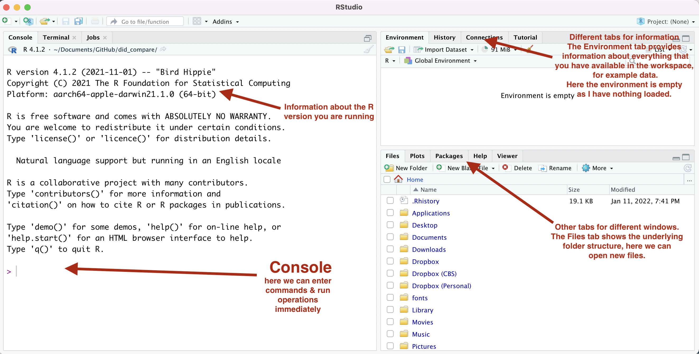
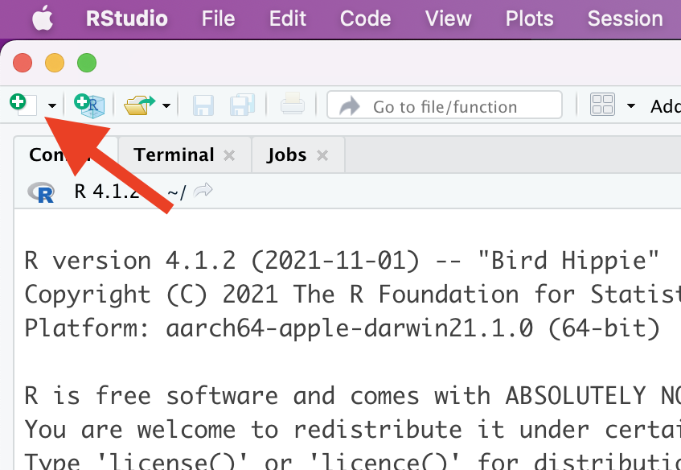

*R* Crash Course CBS
================
Florian M. Hollenbach
2022-01-17

# Getting Started in *R* & RStudio

In this class we will work with and analyze data in *R*. *R* is a
programming language that is widely used for data manipulation,
visualization, and analysis. *R* is an open source program and is free
for anyone. Many of the functions and packages (more on this later) we
will use within *R* are written by other *R* users. While we work with
the *R* program, we will use a different program as the graphical
interface. Specifically, we will use the RStudio IDE (integrated
development environment) to work in *R*. Both programs are available for
free.

*R* can be very hard to learn initially, especially if you have never
programmed before. You will encounter situations where you are
completely lost and might have no idea what to do or what the next step
should be. **This is completely normal!** Hadley Wickham works for
RStudio and is one of the most prolific programmers in R. We will work
with many of his packages throughout the course. As Hadley notes, it is
completely normal to feel lost when starting to program:
<center>

<figure>
<figcaption aria-hidden="true">Hadley Wickham</figcaption>
</figure>

</center>

In addition, it is important that you ask question when you are stuck.
We will have a discussion forum on Canvas and you should try to make use
of it as much as possible. If you are stuck and don’t know where to go
next, ask in class or in the discussion forum. **There are no stupid
questions!**

## Installing *R* & RStudio

The first step is to correctly install *R* on your machine. Please go to
<https://cloud.r-project.org/>. Then click on the link to download the
latest version of *R* for your specific operating system. Once you have
downloaded the program, follow the general instructions to install *R*.

After installing *R*, we need to install the RStudio IDE. You can
download the latest version of RStudio
[here](https://www.rstudio.com/products/rstudio/download/#download).
Once you have downloaded RStudio, follow the instructions and install
the program.

Once you have installed both programs, open up RStudio. You should see
something like this:
<center>



</center>

This is the RStudio program. We will work with this program when
manipulating, analyzing, or visualizing any data. Start by looking
around in RStudio and try to familiarize yourself with the program.

You can adjust the appearance (for example, font or background color) if
you click on RStudio → Preferences → Appearance.

## Getting started with *R* & RStudio

In the console, you can write code that is immediately executed (or
evaluated) by *R* once you hit enter. For example, set the cursor by
clicking to the right of to the little angle bracket \>.

Now type `4+4` and hit enter/return. You should see that *R* evaluates
the command and prints the solution and look like this.
<center>


</center>

Just note that in the following text, the output looks slightly
different when commands are evaluated:

``` r
4+4
```

    ## [1] 8

After *R* prints the result of the evaluated command, it once again
provides the angle bracket, telling us that *R* is ready to execute the
next command. *R* is a really good calculator, try entering some simple
calculations in the console and have *R* execute them. The following
mathematical operators are probably most often used: - `+`: addition

-   `-`: subtraction

-   `/`: division

-   `*`: multiplication

-   `^`: exponentiation

-   `sqrt()`: square root

Try out some calculations yourself! Note that *R* follows standard order
of operations rules, so it can be important to use parentheses.

``` r
7 + 3/5
```

    ## [1] 7.6

``` r
(7 + 3)/5
```

    ## [1] 2

*R* also has operators to evaluate logical expressions, meaning *R*
evaluates whether a statement is *true* or *false*:

-   `==`: is equal to

-   `!=`: is NOT equal to

-   `<`: smaller than

-   `>`: greater than

For example, we can ask *R* whether three is smaller than five or
whether seven is equal to 0:

``` r
3 < 5
```

    ## [1] TRUE

``` r
7 == 0
```

    ## [1] FALSE

We can also connect different logical statements with the logical
operators for *and* or *or*: `&`; `|`:

``` r
3 < 5 & 7 == 0
```

    ## [1] FALSE

``` r
3 < 5 | 7 == 0 
```

    ## [1] TRUE

The `#` operator is special in *R*, as it denotes comments. Anything
that is in a line behind the `#` is ignored by *R* and not evaluated.
Try writing `# 3 + 4` and hit return. You will see that *R* does not
evaluate the command. The `#` is used to add comments into rcode, we
will return to the importance of this later.

Anything you write in the console is immediately interpreted by *R* once
you hit `Enter`/`Return`. In general, we could enter any command here in
the **Console** and have *R* execute the command. This is bad practice,
however, and should be avoided as much as possible. When we write and
evaluate code directly in the **Console** it is executed at once and
then lost. Think of you using a sheet of paper to make a calculation and
then immediately discarding the piece of paper. Instead of working
directly in the Console, we write *Rcode* in a basic script that we can
save (this is equivalent to a do-file, if you have worked with Stata
before). Writing code in the script will allow us to save our code and
re-execute the commands at any time in the future. Working with scripts
also ensures that our work is *reproducible*, i.e., others can go back
and check whether our work was correct. This is of great importance,
especially when doing scientific research.

To open a new *rscript*, click on the little white plus in the upper
left corner of RStudio and select `R Script`.
<center>


</center>

Once you have an rscript open, the first step should be to save it
somewhere sensible. For example, you might create a folder for this
course and save all rscripts for class in that folder. You should pick a
name for your rscript that makes sense and reminds you about the
contents of the script. For example, you could save this first rscript
as `Rcrashcourse.R`.

You should practice writing anything you do in *R* in a rscript. Start
by repeating a few of the simple calculations that you did above. Write
each calculation in a separate line:

``` r
4+4
```

    ## [1] 8

``` r
9+2
```

    ## [1] 11

``` r
3/2
```

    ## [1] 1.5

You might notice that nothing happens when you write code in the rscript
and hit enter. To execute the rcode that is in our script, we have to
send it to the console. We can do so by having the cursor in the line we
want to execute and then hitting `Ctrl + Enter` (Windows) or
`Command + Return` (Mac). Alternatively, you can select one or multiple
lines to execute and then hit `Ctrl + Enter` (Windows) or
`Command + Return` (Mac). Try selecting some code you wrote by executing
the line.

<center>

<figure>
<figcaption aria-hidden="true">Executing code from rscripts</figcaption>
</figure>

</center>

It is good practice to add plenty of comments to your rscripts, so that
others can understand what you are doing (and why). It will also help
your future self when you open old code. The comments will help you
remember why you wrote certain code and what your reasoning was.
Remember, we can include comments using the `#` symbol. Anything in a
line behind the `#` symbol will not be executed by *R*.

``` r
# this is our first rscript
# in the first line we calculate four plus four
4+4 # comments can also go behind a command we want to execute, anything before # will still be executed
```

    ## [1] 8

``` r
#### we can also use multiple # to mark comments
# or we can have an empty comment line
#
#
# next we calculate nine plus two 
9+2 
```

    ## [1] 11

``` r
# next we want to divide 3 by 2
3/2
```

    ## [1] 1.5

One important operator in *R* is the **assignment operator**. With the
assignment operator we can assign values/numbers/words to objects that
are rembered by *R*. For example, we might want *R* to remember that my
name is ‘Florian’, so we assign the word ‘Florian’ to the object called
name. There are actually two assignment operators in *R*:

1.  `<-`

2.  `=`

It doesn’t really matter which one you use, but you should decide early
and use one consistently. In this course, the examples will all use the
`<-` assignment operator.

``` r
name <- 'Florian'
```
