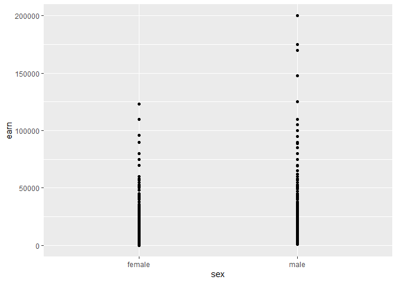

# **Packages**

Packages are the fundamental units of R code. They include reusable R functions, the documentation that describes how to use them, and sample data. 

By default, R installs a set of packages during installation. More packages can be added later, when they are needed for some specific purpose. 

There is an *infinite* amount of packages available that can help you do, literally, anything: from [basic data analysis](https://www.tidyverse.org/), [sending emails](https://github.com/rpremraj/mailR) or [writing blogs](https://rpubs.com/yanalytics/rwordpress) inside R, all the way to packages that have [Flavor Flav yelling “yeaaahhhh, boi!!”](https://github.com/brooke-watson/BRRR) in R as soon as your code successfully completes.

Packages allow you to expand the types of analyses you do be adding other packages. A complete [list of contributed packages](https://cran.r-project.org/web/packages/) is available from CRAN.

### Fortunes

Let's try with one useless, but fun R package, `fortunes`, which... tells fortunes, supplied by various coders over the years.

You *install* a package as follows:


```r
install.packages("[packagename]")
```

For example, we can install this from the R Project repo:


```r
install.packages("fortunes",repos="https://cloud.r-project.org")
```

```
## package 'fortunes' successfully unpacked and MD5 sums checked
## 
## The downloaded binary packages are in
## 	C:\Users\Rasmus\AppData\Local\Temp\Rtmpmisdf3\downloaded_packages
```

After installing, we *load* the package using the `library()` function, as so.

You **always** want to load all the necessary packages at the top of your script.


```r
library("fortunes")
```

```
## Warning: package 'fortunes' was built under R version 4.0.3
```

Now we can use the package functions. `fortunes` has one simple function, `fortune()`, which we can run as so:


```r
fortune()
```

```
## 
## As one of the developers of the nls function I would like to state that the
## lack of automatic ANOVA, R^2 and adj. R^2 from nls is a feature, not a bug :-)
##    -- Douglas Bates (in reply to a request for automatic ANOVA of NLS models as
##       in Statistica)
##       R-help (August 2000)
```

### Tidyverse

Now let's try something that you will likely use going forward, the standout "tidyverse" for R.

The *tidyverse* is acollection of R packages designed for data science. All packages share an underlying design philosophy, grammar, and data structures. You can do read data, do data analysis, visualisation and more.

We can install and load the package as follows:


```r
install.packages("tidyverse",repos="https://cloud.r-project.org")
```

```
## package 'tidyverse' successfully unpacked and MD5 sums checked
## 
## The downloaded binary packages are in
## 	C:\Users\Rasmus\AppData\Local\Temp\Rtmpmisdf3\downloaded_packages
```

```r
library(tidyverse)
```

```
## Warning: package 'tidyverse' was built under R version 4.0.5
```

```
## Warning: package 'ggplot2' was built under R version 4.0.5
```

```
## Warning: package 'tibble' was built under R version 4.0.5
```

```
## Warning: package 'tidyr' was built under R version 4.0.5
```

```
## Warning: package 'readr' was built under R version 4.0.5
```

```
## Warning: package 'dplyr' was built under R version 4.0.5
```

```
## Warning: package 'forcats' was built under R version 4.0.5
```

With `tidyverse`, we can do some of the basic things needed, including reading data, wrangling data, and visualising data. We'll get to that below.

------

# **Where to get help and inspiration?**

To be perfectly honest, any data science and programming journey relies *heavily* on help. One of the great things about the R system is that there is a *ton* of help to be found, from internal RStudi resources, to package documentation, online developer communities (like [Stackoverflow](https://stackoverflow.com/)), and much, much more. 

### Online resources

The notes below draw heavily on some these resources, in particular (all freely available online):

- Hadley Wickham's book [R for Data Science](https://r4ds.had.co.nz/index.html).
- Dirk Eddelbuettel's [Data Science Programming Methods lectures](https://stat447.com/).
- Kieran Healy's [Data Visualization: A practical introduction](https://socviz.co/)
- [RStudio Cheatsheets](https://www.rstudio.com/resources/cheatsheets/)

Two bits we'll use below, tidyverse and ggplot2, you can find package details here:
- [tidyverse](https://www.tidyverse.org/)
- [ggplot2](https://ggplot2.tidyverse.org/index.html)

### Help functions in RStudio

You can also find help right here in RStudio.

The `help()` function and `?` help operator in R provide access to the documentation pages for R functions, data sets, and other objects, both for packages in the standard R distribution and for contributed packages. To access documentation for the standard `lm` (linear model) function, for example, enter the command `help(lm)` or `help("lm")`, or `?lm` or `?"lm"` (i.e., the quotes are optional):


```r
?lm()
```

```
## starting httpd help server ... done
```

### Vignettes

Many packages include *vignettes*, which are discursive documents meant to illustrate and explain facilities in the package. You can discover vignettes by accessing the help page for a package, or via the browseVignettes() function: the command `browseVignettes()` opens a list of vignettes from all of your installed packages in your browser, while `browseVignettes(package=package-name)` (e.g., `browseVignettes(package="survival")`) shows the vignettes, if any, for a particular package. `vignette()` is employed similarly, but displays a list of vignettes in text form.

### R Help on the Internet

There are internet search sites that are specialized for R searches, including [search.r-project.org](https://www.search.r-project.org).

It is also possible to use a general search site like Google, by qualifying the search with “R” or the name of an R package (or both). It can be particularly helpful to paste an error message into a search engine to find out whether others have solved a problem that you encountered.

------

# **Data loading and wrangling**

### Reading data

R can read or write just about anything from text files, just about any existing database backend, specialised files (xls,xlsx, statistics packages), via connections from programs, URLs, and more.

`Tidyverse` has a package called `readr` which is great for importing data into R. 

Most of `readr`’s functions are concerned with turning flat files into data frames:

* read_csv() reads comma delimited files, 
* read_csv2() reads semicolon separated files (common in countries where , is used as the decimal place), 
* read_tsv() reads tab delimited files, and read_delim() reads in files with any delimiter.

These functions all have similar syntax: once you’ve mastered one, you can use the others with ease. For the rest of this chapter we’ll focus on read_csv(). Not only are csv files one of the most common forms of data storage, but once you understand read_csv(), you can easily apply your knowledge to all the other functions in readr.

### read_csv()/read_csv2()

Let's work with the `read_csv` option first: Often you'll be loading in Comma-separated values (.csv) files, basically slimmed-down Excel files.

The first argument to read_csv() is the most important: it’s the path to the file to read.

The `read_csv()` function can read both from online and from an online location - with a URL - or from your local data.

Let's try loading .csv file called heights.csv from an online location, and saving that to an object called `heights`


```r
heights <- read_csv("https://raw.githubusercontent.com/phdskat/RCrashcourse2/main/heights.csv")
```

```
## Rows: 1192 Columns: 6
```

```
## -- Column specification --------------------------------------------------------
## Delimiter: ","
## chr (2): sex, race
## dbl (4): earn, height, ed, age
```

```
## 
## i Use `spec()` to retrieve the full column specification for this data.
## i Specify the column types or set `show_col_types = FALSE` to quiet this message.
```

We can do the exact same from your loca data - if you download the `heights.csv` file from the [RCrashcourse2 repository](https://github.com/phdskat/RCrashcourse2).

You then have to put the data somewhere useful for the package to load your data. 

One common thing to do can do is place it right next to your R project files, if you have set up an R project. R's starting point when load files is that they are placed in the R project folder, so that you can easily read it:


```r
heights <- read_csv("heights.csv")
```

```
## Rows: 1192 Columns: 6
```

```
## -- Column specification --------------------------------------------------------
## Delimiter: ","
## chr (2): sex, race
## dbl (4): earn, height, ed, age
```

```
## 
## i Use `spec()` to retrieve the full column specification for this data.
## i Specify the column types or set `show_col_types = FALSE` to quiet this message.
```

When you run `read_csv()` it prints out a column specification that gives the name and type of each column.

### Wrangling

Data wrangling is the art of getting your data into R in a useful form for visualisation and modelling. Data wrangling is very important: without it you can’t work with your own data! 

Often you’ll need to create some new variables or summaries, or maybe you just want to rename the variables or reorder the observations in order to make the data a little easier to work with.

Here, we'll go through how to (over)view your data, how to over(view) your data, basic data transformation, and how to do basic exploratory data analysis.

### Viewing your data

Let's start with the `heights` data again. 

The `View()` function in R invokes a spreadsheet-style data viewer on a matrix-like R object. To view all the contents of a defined object, use the `View()` function:


```r
View(heights)
```

### Glance at data

The `head()` function the first or last parts of a vector, matrix, table, data frame or function:


```r
head(heights)
```

```
## # A tibble: 6 x 6
##    earn height sex       ed   age race 
##   <dbl>  <dbl> <chr>  <dbl> <dbl> <chr>
## 1 50000   74.4 male      16    45 white
## 2 60000   65.5 female    16    58 white
## 3 30000   63.6 female    16    29 white
## 4 50000   63.1 female    16    91 other
## 5 51000   63.4 female    17    39 white
## 6  9000   64.4 female    15    26 white
```

### The tidyverse pipe!

Pipes are a powerful tool for clearly expressing a sequence of multiple operations. So far, you’ve just been calling functions plainly. Here, it's time to explore the pipe in more detail.

The pipe, `%>%`, comes from the `magrittr` package by Stefan Milton Bache. Packages in the tidyverse load %>% for you automatically, so you don’t usually load magrittr explicitly.

The point of the pipe is to help you write code in a way that is easier to read and understand. To see why the pipe is so useful, we’re going to explore a number of ways of writing the same code. Let's use the code above:


```r
# To see the head() or our data, we can either do this, which is the old way of doing things:

head(heights)
```

```
## # A tibble: 6 x 6
##    earn height sex       ed   age race 
##   <dbl>  <dbl> <chr>  <dbl> <dbl> <chr>
## 1 50000   74.4 male      16    45 white
## 2 60000   65.5 female    16    58 white
## 3 30000   63.6 female    16    29 white
## 4 50000   63.1 female    16    91 other
## 5 51000   63.4 female    17    39 white
## 6  9000   64.4 female    15    26 white
```

```r
# Or we can pass the data object, with the pipe, to the head() function. It's the same outcome. We will use this going forward.

heights %>% head()
```

```
## # A tibble: 6 x 6
##    earn height sex       ed   age race 
##   <dbl>  <dbl> <chr>  <dbl> <dbl> <chr>
## 1 50000   74.4 male      16    45 white
## 2 60000   65.5 female    16    58 white
## 3 30000   63.6 female    16    29 white
## 4 50000   63.1 female    16    91 other
## 5 51000   63.4 female    17    39 white
## 6  9000   64.4 female    15    26 white
```

### Then pull request it into Florian's github

This is trivial when doing single operations, but when you do multiple ones, as we'll see below, it is incredibly useful!

### Filtering

`filter()` allows you to subset observations based on their values. The first argument is the name of the data frame. The second and subsequent arguments are the expressions that filter the data frame. For example, we can select everyone aged exactly 45 in the data:


```r
heights %>% filter(age==45)
```

```
## # A tibble: 19 x 6
##      earn height sex       ed   age race    
##     <dbl>  <dbl> <chr>  <dbl> <dbl> <chr>   
##  1  50000   74.4 male      16    45 white   
##  2  34000   72.1 male      12    45 white   
##  3  60000   74.0 male      13    45 white   
##  4 125000   74.3 male      18    45 white   
##  5 170000   71.0 male      18    45 white   
##  6  22000   73.5 female    14    45 white   
##  7  12000   67.6 female    12    45 white   
##  8  35000   72.4 male      15    45 white   
##  9  18000   71.1 male      16    45 white   
## 10  21000   67.4 female    12    45 white   
## 11  33000   66.4 female    12    45 black   
## 12   8000   63.2 female     9    45 white   
## 13  19000   62.7 female    15    45 hispanic
## 14  18000   60.8 female    14    45 white   
## 15  25000   64.3 female    14    45 white   
## 16  36000   63.4 female    16    45 white   
## 17  19000   68.1 female    13    45 white   
## 18   4000   64.2 female    16    45 white   
## 19  60000   71.8 male      12    45 white
```

When you run that line of code, the `dplyr` package in tidyverse executes the filtering operation and returns a new data frame. If you want to save the result, you’ll need to use the assignment operator, `<-`:


```r
age45 <- heights %>% filter(age == 45)
```

### Arranging

`arrange()` works similarly to `filter()` except that instead of selecting rows, it changes their order. It takes a data frame and a set of column names (or more complicated expressions) to order by. If you provide more than one column name, each additional column will be used to break ties in the values of preceding columns:


```r
heights %>% arrange(age)
```

```
## # A tibble: 1,192 x 6
##     earn height sex       ed   age race 
##    <dbl>  <dbl> <chr>  <dbl> <dbl> <chr>
##  1  3500   71.6 male      10    18 white
##  2  4000   72.7 male      13    18 white
##  3 15000   68.5 female    12    18 white
##  4  1000   64.7 female    12    18 white
##  5   600   70.2 female    12    18 black
##  6  3000   70.6 male      11    18 black
##  7  5000   62.5 female    12    18 white
##  8  1000   64.7 female    12    18 white
##  9  1000   65.5 male      12    18 white
## 10 50000   69.1 male      11    18 white
## # ... with 1,182 more rows
```

Use `desc()` to re-order by a column in descending order:


```r
heights %>% arrange(desc(age))
```

```
## # A tibble: 1,192 x 6
##     earn height sex       ed   age race 
##    <dbl>  <dbl> <chr>  <dbl> <dbl> <chr>
##  1 50000   63.1 female    16    91 other
##  2 24000   65.0 female    12    91 white
##  3 27000   73.1 male      12    91 white
##  4 25000   67.3 male      12    89 white
##  5 20000   59.6 female    16    88 other
##  6  5000   63.1 female    10    87 white
##  7 25000   64.9 male      16    86 white
##  8  4500   58.0 female     5    85 white
##  9 35000   69.9 male       9    84 white
## 10 25000   58.9 female    15    83 white
## # ... with 1,182 more rows
```

### Select

It’s not uncommon to get datasets with hundreds or even thousands of variables. In this case, the first challenge is often narrowing in on the variables you’re actually interested in. `select()` allows you to rapidly zoom in on a useful subset using operations based on the names of the variables.


```r
# Select columns by name

select(heights, sex, age, race)
```

```
## # A tibble: 1,192 x 3
##    sex      age race    
##    <chr>  <dbl> <chr>   
##  1 male      45 white   
##  2 female    58 white   
##  3 female    29 white   
##  4 female    91 other   
##  5 female    39 white   
##  6 female    26 white   
##  7 female    49 white   
##  8 male      46 white   
##  9 male      21 hispanic
## 10 male      26 white   
## # ... with 1,182 more rows
```

### Add new variables

Besides selecting sets of existing columns, it’s often useful to add new columns that are functions of existing columns. That’s the job of `mutate()`:


```r
# we can use the pipe to first add a new column, then arrange by it, so we get a list of the tallest people (in cm)

heights %>% 
  mutate(heightcm = height * 2.54) %>% 
  arrange(-heightcm)
```

```
## # A tibble: 1,192 x 7
##     earn height sex      ed   age race  heightcm
##    <dbl>  <dbl> <chr> <dbl> <dbl> <chr>    <dbl>
##  1 60000   77.1 male     17    42 white     196.
##  2 32000   76.8 male     16    30 white     195.
##  3 41000   76.8 male     16    33 white     195.
##  4 28000   76.7 male     14    28 white     195.
##  5 89000   76.5 male     16    41 white     194.
##  6 20000   76.4 male     14    26 white     194.
##  7 12000   76.2 male     12    57 white     194.
##  8 16000   76.2 male     15    32 white     193.
##  9 27000   76.0 male     12    39 white     193.
## 10 40000   75.6 male     16    38 black     192.
## # ... with 1,182 more rows
```

### Summarise

The last key verb is `summarise()`. It collapses a data frame to a single row.

The `summarise()` function is most useful when we pair it with `group_by()`. This changes the unit of analysis from the complete dataset to individual groups. Say we want to know the average age of each sex group (males and females)


```r
# group this with the pipe

heights %>% 
  group_by(sex) %>% 
  summarise(mean(age))
```

```
## # A tibble: 2 x 2
##   sex    `mean(age)`
##   <chr>        <dbl>
## 1 female        42.3
## 2 male          40.2
```

There are *many* summary functions available beyond `mean()`:

* Center: mean(), median()
* Spread: sd(), IQR(), mad()
* Range: min(), max(), quantile()
* Position: first(), last(), nth(),
* Count: n(), n_distinct()
* Logical: any(), all()

------

# **Simple regression analysis**

In R, with the `heights` data, we can do a simple linear regression to predict a quantitative outcome y on the basis of one single predictor variable x. 

For instance, we can try to see if the variable `age` is a predictor of `earn`, using the base R `lm()` function (linear model).

The lm command takes the variables in the format:


```r
lm([target variable] ~ [predictor variables], data = [data source])
```

So we do as follows:


```r
# create the model

model <- lm(earn ~ age, data = heights)

# see the model

model
```

```
## 
## Call:
## lm(formula = earn ~ age, data = heights)
## 
## Coefficients:
## (Intercept)          age  
##    19041.53        99.41
```

The output tells us that the predicted earnings for someone aged 0 is just above 19.000, and for every additional 1 year, the average person is expected to earn just about 100 more.

To review the results in more detail, we can use the `summary()` function:


```r
summary(model)
```

```
## 
## Call:
## lm(formula = earn ~ age, data = heights)
## 
## Residuals:
##    Min     1Q Median     3Q    Max 
## -25098 -12622  -3667   6883 177579 
## 
## Coefficients:
##             Estimate Std. Error t value Pr(>|t|)    
## (Intercept) 19041.53    1571.26  12.119  < 2e-16 ***
## age            99.41      35.46   2.804  0.00514 ** 
## ---
## Signif. codes:  0 '***' 0.001 '**' 0.01 '*' 0.05 '.' 0.1 ' ' 1
## 
## Residual standard error: 19420 on 1190 degrees of freedom
## Multiple R-squared:  0.006561,	Adjusted R-squared:  0.005727 
## F-statistic:  7.86 on 1 and 1190 DF,  p-value: 0.005137
```

Here we can see, for instance, the p-values, the R-squared, and so on, which we can use to evaluate the linear model.

------

# **Data visualisation**

>“The simple graph has brought more information to the data analyst’s mind than any other device.”
>— John Tukey

R has several systems for making graphs, but `ggplot2`, which is part of `tidyverse` is one of the most elegant and most versatile. `ggplot2` implements the grammar of graphics, a coherent system for describing and building graphs. With `ggplot2`, you can do more faster by learning one system and applying it in many places.

### First steps

Let’s use our first graph to answer a question: 

Do males people earn more than females? You probably already have an answer, but try to make your answer precise. What does the relationship between sex and earnings look like? 

You can test your answer with the `heights` data frame we have used throughout. A data frame is a rectangular collection of variables (in the columns) and observations (in the rows).

### Creating a ggplot

To plot the sex-earn relationship, run this code to put `sex` on the x-axis and `earn` on the y-axis:


```r
ggplot(data = heights) + 
  geom_point(mapping = aes(x = sex, y = earn))
```

<!-- -->

The plot shows a strong relationship between sex and earnings. In simple terms, males tend to earn more than women. Does this confirm or refute your hypothesis?

With ggplot2, you begin a plot with the function `ggplot()`. `ggplot()` creates a coordinate system that you can add layers to. The first argument of `ggplot()` is the dataset to use in the graph. So `ggplot(data = heights)` creates an empty graph, but it’s not very interesting so I’m not going to show it here.

You complete your graph by adding one or more layers to `ggplot()`. The function `geom_point()` adds a layer of points to your plot, which creates a scatterplot. ggplot2 comes with many geom functions that each add a different type of layer to a plot. You’ll learn a whole bunch of them throughout this chapter.

Each geom function in ggplot2 takes a `mapping` argument. This defines how variables in your dataset are mapped to visual properties. The `mapping` argument is always paired with `aes()`, and the x and y arguments of aes() specify which variables to map to the x and y axes. ggplot2 looks for the mapped variables in the `data` argument, in this case, `heights`.

### A graphing template

Let’s turn this code into a reusable template for making graphs with ggplot2. To make a graph, replace the bracketed sections in the code below with a dataset, a geom function, or a collection of mappings.


```r
ggplot(data = <DATA>) + 
  <GEOM_FUNCTION>(mapping = aes(<MAPPINGS>))
```

------

# **Extra stuff (if we have the time):**

### Flows

There are two primary tools of controlling "flows" in R: choices and loops. 

We'll focus on *choices*, in particular "if" and "if/else" statements, which are decision-making devices built into your programming using conditional statements.

You can also use *loops*, like "for" and "while" loops, which allow you to repeatedly run code, typically with changing options.

We'll focus on *choices* here, with `if()` and `ifelse()`.

### if()

The syntax of the if statement is:


```r
if (test_expression) {
  statement
}
```
If the `test_expression` is `TRUE`, the statement gets executed. But if it’s FALSE, nothing happens.

For example:


```r
x <- 5
if(x > 0){
print("Positive number")
}
```

```
## [1] "Positive number"
```

### ifelse()

The syntax of if…else statement is:


```r
if (test_expression) {
  statement1
} else {
  statement2
}
```

For example:


```r
x <- -5
if(x > 0){
print("Non-negative number")
} else {
print("Negative number")
}
```

```
## [1] "Negative number"
```

------
